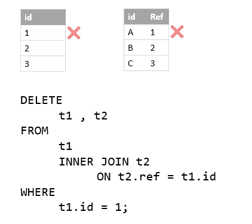

在本教程中，我们将向您展示如何使用MySQL `DELETE JOIN`语句来从多个表中删除数据。

在上一个教程中，我们学习了如何使用以下方式删除多个表的行记录：

- 在多个表上使用单个[DELETE语句](http://www.yiibai.com/mysql/delete-statement.html)删除数据。
- 多个相关表上的使用单个`DELETE`语句，子表具有对[外键](http://www.yiibai.com/mysql/foreign-key.html)的[ON DELETE CASCADE](http://www.yiibai.com/mysql/on-delete-cascade.html)引用操作。

本教程将介绍一种使用[INLEER JOIN](http://www.yiibai.com/mysql/inner-join.html)或[LEFT JOIN](http://www.yiibai.com/mysql/left-join.html)子句与`DELETE`语句从多个表中删除数据的更灵活的方法。

## MySQL DELETE语句使用INNER JOIN子句

MySQL还允许在`DELETE`语句中使用`INNER JOIN`子句来从表中删除和另一个表中的匹配的行记录。

例如，要从符合指定条件的`T1`和`T2`表中删除行记录，请使用以下语句：

```sql
DELETE T1, T2
FROM T1
INNER JOIN T2 ON T1.key = T2.key
WHERE condition
```

请注意，将`T1`和`T2`表放在`DELETE`和`FROM`关键字之间。如果省略`T1`表，`DELETE`语句仅删除`T2`表中的行记录。 同样，如果省略了`T2`表，`DELETE`语句将只删除`T1`表中的行记录。

表达式`T1.key = T2.key`指定了将被删除的`T1`和`T2`表之间的匹配行记录的条件。

`WHERE`子句中的条件确定`T1`和`T2`表中要被删除的行记录。

## MySQL DELETE语句使用INNER JOIN示例

假设有两个表`t1`和`t2`，其结构和数据如下：

```sql
USE testdb;

DROP TABLE IF EXISTS t1, t2;

CREATE TABLE t1 (
    id INT PRIMARY KEY AUTO_INCREMENT
);

CREATE TABLE t2 (
    id VARCHAR(20) PRIMARY KEY,
 ref INT NOT NULL
);

INSERT INTO t1 VALUES (1),(2),(3);

INSERT INTO t2(ref) VALUES('A',1),('B',2),('C',3);
```

连接删除语句如下图中所示 -



以下语句删除`t1`表中`id=1`的行，并使用`DELETE ... INNER JOIN`语句删除`t2`表中的`ref=1`的行记录：

```sql
DELETE t1 , t2 FROM t1
        INNER JOIN
    t2 ON t2.ref = t1.id 
WHERE
    t1.id = 1;
```

该语句返回以下消息：

```sql
2 row(s) affected
```

它表示一共有两行记录已被删除了。

## MySQL DELETE与LEFT JOIN子句

我们经常在`SELECT`语句中使用[LEFT JOIN](http://www.yiibai.com/mysql/left-join.html)子句来查找左表中以及右表中不匹配行的行记录。

我们还可以在`DELETE`语句中使用`LEFT JOIN`子句删除表(左表)中没有与其他表(右表)中的匹配的行记录。

以下语法说明如何使用`DELETE`语句与`LEFT JOIN`子句来删除与`T2`表中没有相应匹配行的表`T1`中的行记录：

```sql
DELETE T1 
FROM T1
        LEFT JOIN
    T2 ON T1.key = T2.key 
WHERE
    T2.key IS NULL;
```

请注意，我们只将`T1`表放在`DELETE`关键字之后，而不是像`INNER JOIN`子句那样使用两个表名：`T1`和`T2`。

## MySQL DELETE连接LEFT JOIN示例

在示例数据库(`yiibaidb`)中查看以下`orders`和`orderdetails`表：


每个客户都有零个或多个订单。 但是，每个订单都属于唯一的一个客户。

可以使用`DELETE`语句与`LEFT JOIN`子句来清理客户数据。 以下声明删除未下订单的客户：

```sql
DELETE customers 
FROM customers
        LEFT JOIN
    orders ON customers.customerNumber = orders.customerNumber 
WHERE
    orderNumber IS NULL;
```

可以通过查询没有任何订单的客户，使用以下查询来验证删除：

```sql
SELECT 
    c.customerNumber, 
    c.customerName, 
    orderNumber
FROM
    customers c
        LEFT JOIN
    orders o ON c.customerNumber = o.customerNumber
WHERE
    orderNumber IS NULL;
```

该查询返回一个空结果集，这正如我们所预期的那样。

在本教程中，您已经学会了如何使用MySQL `DELETE JOIN`语句从两个或多个表中删除数据。