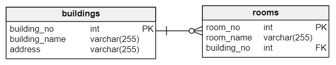

在本教程中，您将学习如何使用MySQL `ON DELETE CASCADE`引用操作来执行外键从多个相关表中删除数据。

在上一个教程中，我们学习了如何使用单个[DELETE语句](http://www.yiibai.com/mysql/delete-statement.html)从一个或多个相关表中删除数据。但是，MySQL提供了一种更为有效的方法，称为`ON DELETE CASCADE`对于[外键](http://www.yiibai.com/mysql/foreign-key.html)的引用操作，可以实现在从父表中删除数据时自动删除子表中的数据。

## 1. MySQL ON DELETE CASCADE示例

下面来看一些使用MySQL `ON DELETE CASCADE`的例子。

假设有两张表：建筑物(`buildings`)和房间(`rooms`)。 在这个数据库模型中，每个建筑物都有一个或多个房间。 然而，每个房间只属于一个建筑物。没有建筑物则房间是不会存在的。

建筑物和房间表之间的关系是一对多(*1：N*)，如下面的数据库图所示：



当我们从`buildings`表中删除一行时，还要删除`rooms`表中引用建筑物表中行的行。 例如，当删除建筑编号(`building_no`)为`2`的行记录时，在`buildings`表上执行如下查询：

```sql
DELETE FROM buildings 
WHERE
    building_no = 2;
```

我们希望`rooms`表中涉及到建筑物编号`2`的行记录也将被删除(讲得通俗一点：假设`2`号楼倒塌了，那么`2`号楼的房间应该也就不存在了)。以下是演示MySQL `ON DELETE CASCADE`参考操作如何工作的步骤。

**第一步**， 创建`buildings`表，如下创建语句：

```sql
USE testdb;
CREATE TABLE buildings (
    building_no INT PRIMARY KEY AUTO_INCREMENT,
    building_name VARCHAR(255) NOT NULL,
    address VARCHAR(255) NOT NULL
)ENGINE=InnoDB DEFAULT CHARSET=utf8;
```

**第二步**， 创建`rooms`表，如下创建语句：

```sql
USE testdb;
CREATE TABLE rooms (
    room_no INT PRIMARY KEY AUTO_INCREMENT,
    room_name VARCHAR(255) NOT NULL,
    building_no INT NOT NULL,
    FOREIGN KEY (building_no)
        REFERENCES buildings (building_no)
        ON DELETE CASCADE
)ENGINE=InnoDB DEFAULT CHARSET=utf8;
```

请注意，在外键约束定义的末尾添加`ON DELETE CASCADE`子句。

**第三步**， 将一些数据插入到`buildings`表，如下插入语句：

```sql
INSERT INTO buildings(building_name,address)
VALUES('海南大厦','海口市国兴大道1234号'),
      ('万达水城','海口市大同路1200号');
```

**第四步**， 查询`buildings`表中的数据：

```sql
mysql> select * from buildings;
+-------------+---------------+----------------------+
| building_no | building_name | address              |
+-------------+---------------+----------------------+
|           1 | 海南大厦      | 海口市国兴大道1234号 |
|           2 | 万达水城      | 海口市大同路1200号   |
+-------------+---------------+----------------------+
2 rows in set
```

现在可以看到，在建筑物表中有两行记录。

**第五步**， 将一些数据插入到`buildings`表，如下插入语句：

```sql
INSERT INTO rooms(room_name,building_no)
VALUES('Amazon',1),
      ('War Room',1),
      ('Office of CEO',1),
      ('Marketing',2),
      ('Showroom',2);
```

**第六步**， 查询`rooms`表中的数据：

```sql
mysql> select * from rooms;
+---------+---------------+-------------+
| room_no | room_name     | building_no |
+---------+---------------+-------------+
|       1 | Amazon        |           1 |
|       2 | War Room      |           1 |
|       3 | Office of CEO |           1 |
|       4 | Marketing     |           2 |
|       5 | Showroom      |           2 |
+---------+---------------+-------------+
5 rows in set
```

从上面行记录中可以看到，*building_no=1*的建筑有`3`个房间，以及*building_no=2*有`2`个房间。

**第七步**， 删除编号为*2*的建筑物：

```sql
DELETE FROM buildings WHERE building_no = 2;
```

**第八步**， 查询 `rooms`表中的数据 -

```sql
mysql> DELETE FROM buildings WHERE building_no = 2;
Query OK, 1 row affected

mysql> SELECT * FROM rooms;
+---------+---------------+-------------+
| room_no | room_name     | building_no |
+---------+---------------+-------------+
|       1 | Amazon        |           1 |
|       2 | War Room      |           1 |
|       3 | Office of CEO |           1 |
+---------+---------------+-------------+
3 rows in set
```

可以看到，表中只剩下引用`building_no=1`的记录了，引用`building_no=2`的所有行记录都被自动删除了。

> 请注意，`ON DELETE CASCADE`仅支持使用[存储引擎](http://www.yiibai.com/understand-mysql-table-types-innodb-myisam.html)支持外键(如`InnoDB`)的表上工作。 某些表类型不支持诸如`MyISAM`的外键，因此应该在使用MySQL `ON DELETE CASCADE`引用操作的表上选择适当的存储引擎。

**查找受MySQL ON DELETE CASCADE操作影响的表的技巧**

有时，当要从表中删除数据时，知道哪个表受到MySQL `ON DELETE CASCADE`参考操作的影响是有用的。 可从`information_schema`数据库中的`referential_constraints`表中查询此数据，如下所示：

```sql
USE information_schema;

SELECT 
    table_name
FROM
    referential_constraints
WHERE
    constraint_schema = 'database_name'
        AND referenced_table_name = 'parent_table'
        AND delete_rule = 'CASCADE'
```

例如，要使用示例数据库(`testdb`，因为上面两个表是建立在`testdb`数据库之上的)中的`CASCADE`删除规则查找与建筑表相关联的表，请使用以下查询：

```sql
USE information_schema;

SELECT 
    table_name
FROM
    referential_constraints
WHERE
    constraint_schema = 'testdb'
        AND referenced_table_name = 'buildings'
        AND delete_rule = 'CASCADE'
```

执行上面查询语句，得到以下结果 -

```sql
+------------+
| table_name |
+------------+
| rooms      |
+------------+
1 row in set
```

在本教程中，我们一步一步向您展示了如何在从父表中删除数据时，使用MySQL `ON DELETE CASCADE`引用操作从外键自动从子表中删除相关联的数据。