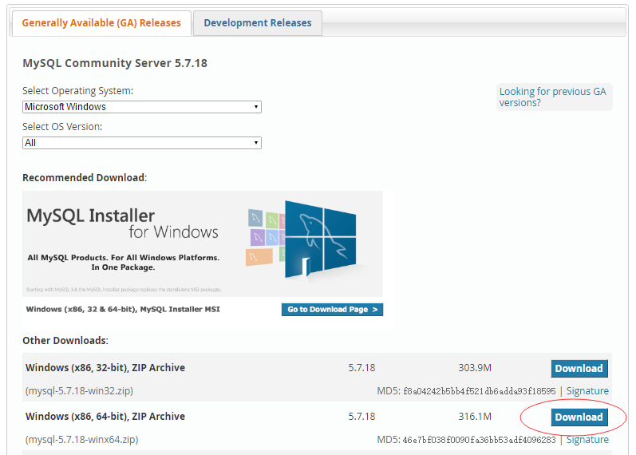
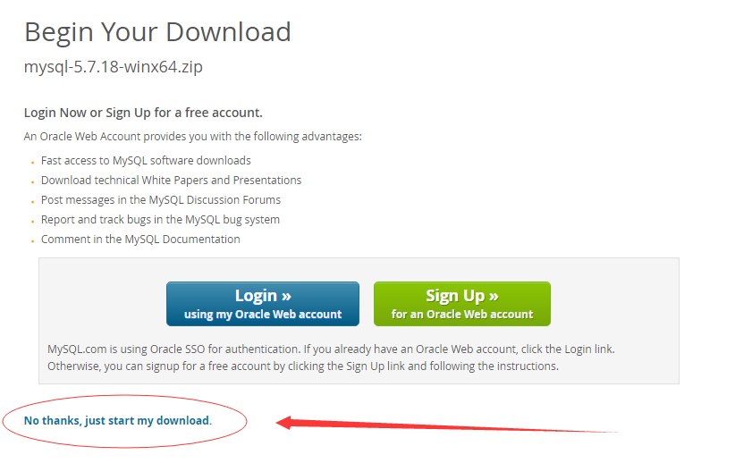
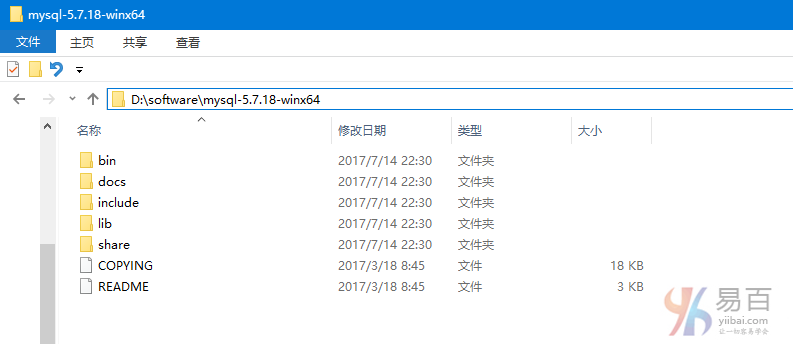

本教程将介绍如何使用 MySQL Installer 在 Windows 平台 (*Win10*) 上安装 MySQL。在学习并按照本教程所示的步骤操作之后，您将有一个 MySQL 数据库服务器在您的系统中，并以此 MySQL 数据库服务器为基础，运行相关工具来学习和实践 MySQL。

## 下载 MySQL 安装程序

这里想要说的是，安装 MySQL 的方式有好几种，由于文章篇幅的限制，这里只选定一种作为安装演示。具体的安装，可以按照你喜欢的方式来。只要有两种方式：

1. 在线安装版，下载：*mysql-installer-web-community.exe*
2. 离线安装版，下载：*mysql-installer-community.exe*
3. 解压缩版，下载：*Windows (x86, 64-bit), ZIP Archive*

上面的下载安装程序，可以从网址： <http://dev.mysql.com/downloads/mysql/> 找到。

如果要在 Windows 环境中安装 MySQL，使用 MySQL 安装程序是最简单的方法。MySQL 安装程序为您提供了一个易于使用的向导，可帮助您使用以下组件安装 MySQL：

- MySQL 服务器
- 所有可用连接器
- 具有示例数据模型的 MySQL Workbench
- MySQL 通知程序
- Excel 和 Microsoft Visual Studio 的工具
- MySQL 示例数据库
- MySQL 文档

现在，我们一步步来看，如何下载并安装 MySQL 服务器软件。

**第一步：下载所需的安装包**

打开网址：<http://dev.mysql.com/downloads/mysql/> ， 如下所示 -



> 注：因为在编写本教程时，使用的是 *Win10 64* 位的操作系统，所以这里选择：*Windows (x86, 64-bit), ZIP Archive* 下载

在弹出的第二个页面中，选择点击 “**No thanks, just start my download.**”  跳过注册/登录帐号环节直接下载。如下图所示 -



然后，耐心等待下载完成…

**第二步：压缩到指定目录**

准备好一个安装 MySQL 程序的目录，如：*D:/software*

在本教程中，您已经学会了如何使用 MySQL 安装程序在 Windows 系统中安装 MySQL，[下载MySQL示例数据库](http://www.yiibai.com/mysql/sample-database.html)并将其加载到 MySQL 服务器中，以通过此 MySQL 教程练习和学习 MySQL。

这里解压后的目录为：*D:\software\mysql-5.7.18-winx64* ， 此目录下的文件如下所示 -



**第三步：启动 MySQL 服务器**

以**管理员身份**打开命令行，进入 *MySQL* 服务器安装的目录：*D:\software\mysql-5.7.18-winx64\bin* ，执行以下命令启动 MySQL

```powershell
Microsoft Windows [版本 10.0.10586]
(c) 2015 Microsoft Corporation。保留所有权利。
C:\WINDOWS\system32>D:
D:\>cd software\mysql-5.7.18-winx64\bin
D:\software\mysql-5.7.18-winx64\bin>mysqld -install
Service successfully installed.
D:\software\mysql-5.7.18-winx64\bin>net start mysql
MySQL 服务正在启动 ..
MySQL 服务已经启动成功。
D:\software\mysql-5.7.18-winx64\bin>
```

如果有提示如下错误

```powershell
D:\software\mysql-5.7.18-winx64\bin> mysqld.exe
mysqld: Can't change dir to 'D:\software\mysql-5.7.18-winx64\data\' (Errcode: 2 - No such file or directory)
2017-07-14T18:48:51.023897Z 0 [Warning] TIMESTAMP with implicit DEFAULT value is deprecated. Please use --explicit_defaults_for_timestamp server option (see documentation for more details).
... ...
2017-07-14T18:48:51.039516Z 0 [Note] Binlog end
2017-07-14T18:48:51.039516Z 0 [Note] mysqld.exe: Shutdown complete
```

上面错误提示中，已经说明了：

```powershell
mysqld: Can't change dir to 'D:\software\mysql-5.7.18-winx64\data\' (Errcode: 2 - No such file or directory)
```

则需要在创建一个目录：*D:\software\mysql-5.7.18-winx64\data\* ，现在我们就来创建这个目录，在创建目录完成后重新执行 `mysqld -install` 启动 MySQL 服务器 -

一定要注意两个问题，切记！

**第一**： 以管理员自身份打开 CMD；
**第二**：用 cd 命令进入到你 MySQL 文件的解压路径。

**第四步：连接 MySQL 服务器**

服务启动成功之后，就可以连接/登录 MySQL 服务器了，打开**命令提交符**界面输入`mysql -u root -p`或 `mysql -h localhost -u root -p`(第一次登录没有密码，直接按回车过),登录成功，但是登录成功后，不能执行任何操作，MySQL服务器要求您必须设置密码再执行其它操作。

假设我们登录成功后，要查看当前目录下所数据名称(执行查询：`show databases`)，但它提示要先设置密码。完整的过程如下所示 -

```powershell
D:\software\mysql-5.7.18-winx64\bin>mysql -hlocalhost -uroot -p
Enter password:
Welcome to the MySQL monitor.  Commands end with ; or \g.
Your MySQL connection id is 4
Server version: 5.7.9

Copyright (c) 2000, 2017, Oracle and/or its affiliates. All rights reserved.

Oracle is a registered trademark of Oracle Corporation and/or its
affiliates. Other names may be trademarks of their respective
owners.

Type 'help;' or '\h' for help. Type '\c' to clear the current input statement.

mysql> show databases;
ERROR 1820 (HY000): You must reset your password using ALTER USER statement before executing this statement.
mysql> ALTER USER 'root'@'localhost' IDENTIFIED BY '123456';
Query OK, 0 rows affected (0.08 sec)

mysql> show databases;
+--------------------+
| Database           |
+--------------------+
| information_schema |
| mysql              |
| performance_schema |
+--------------------+
6 rows in set (0.11 sec)
```

有关解压包安装 MySQL 服务器就这样完成了，如果想要使用在线安装的方式来安装 MySQL，请参考： <http://dev.mysql.com/doc/refman/5.7/en/mysql-installer.html>