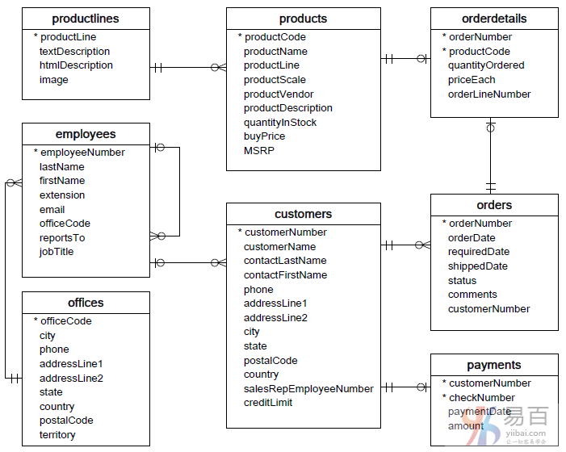
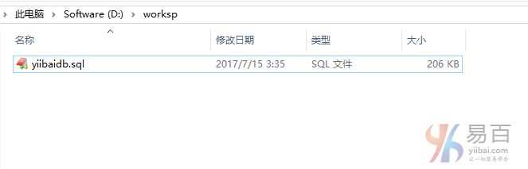

在本 MySQL 教程中，大部分操作是基于`yiibaidb`这个数据库作为学习 MySQL 示例数据库，这样的话有助于您快速有效地使用 MySQL。`yiibaidb`数据库是一个典型汽车零售商数据库模型。它包含典型的业务数据，如客户，产品，销售订单，销售订单等。

我们在 MySQL 教程中使用此示例数据库来演示从[简单查询](http://www.yiibai.com/mysql/basic-mysql.html)到复杂[存储过程](http://www.yiibai.com/mysql/stored-procedure.html)的许多 MySQL 功能。

## 下载 MySQL 示例数据库

可以在以下链接中下载本 MySQL 教程所使用的示例数据库 (*yiibaidb*)。

示例数据库下载地址：<http://www.yiibai.com/downloads/yiibaidb.zip>

在解压缩上面的文件后，可以将示例数据库导入到 MySQL 数据库服务器中，方法如下：[将示例数据库导入到MySQL 数据库服务器中](http://www.yiibai.com/mysql/how-to-load-sample-database-into-mysql-database-server.html)，并使用以下 SQL 语句进行测试：

```sql
USE yiibaidb;
SELECT * FROM customers;
```

上面语句首先将当前数据库切换到`yiibaidb`数据库下，并从`customers`表查询数据。如果您看到返回的客户数据，说明已成功将示例数据库 (`yiibaidb`) 导入MySQL数据库服务器了。

## MySQL 示例数据库结构

MySQL 示例数据库模式由以下表组成：

- `customers`: 存储客户的数据。
- `products`: 存储汽车的数据。
- `productLines`: 存储产品类别数据。
- `orders`: 存储客户订购的销售订单。
- `orderDetails`: 存储每个销售订单的订单产品数据项。
- `payments`: 存储客户订单的付款数据信息。
- `employees`: 存储所有员工信息以及组织结构，例如，直接上级(谁向谁报告工作)。
- `offices`: 存储销售处数据，类似于各个分公司。

表与表之间的关系，请参考以下ER图 -



我们建议您打印出此 ER 图，并将其粘贴到桌面上，以便在学习MySQL的过程中熟悉其中的表之间的关联关系。

## 导入示例数据库

在本教程中，将学习如何在 MySQL 命令行下将 MySQL 示例数据库导入到 MySQL 数据库服务器中。 在本教程之后，您将`yiibaidb`示例数据库导入到 MySQL 服务器中以实践和学习 MySQL。

**第一步：** 从MySQL示例数据库文章中[下载示例数据库](http://www.yiibai.com/downloads/yiibaidb.zip)(`yiibaidb`)，有关示例数据库的结构，请参考： <http://www.yiibai.com/mysql/sample-database.html>

**第二步：** 将下载的文件解压缩到临时文件夹中。为了简单起见，我们将把它解压缩到*D:\worksp*，如下所示 -



**第三步：** 连接到 MySQL 服务器并创建数据库

```powershell
D:\software\mysql-5.7.18-winx64\bin>mysql -hlocalhost -uroot -p
Enter password: ******
Welcome to the MySQL monitor.  Commands end with ; or \g.
Your MySQL connection id is 23
Server version: 5.7.9 MySQL Community Server (GPL)

Copyright (c) 2000, 2017, Oracle and/or its affiliates. All rights reserved.

Oracle is a registered trademark of Oracle Corporation and/or its
affiliates. Other names may be trademarks of their respective
owners.

Type 'help;' or '\h' for help. Type '\c' to clear the current input statement.
```

创建数据库

```sql
mysql> CREATE DATABASE IF NOT EXISTS yiibaidb DEFAULT CHARSET utf8 COLLATE utf8_general_ci;
mysql> use yiibaidb;
```

导入数据

```sql
mysql> use yiibaidb;
mysql> source D:/worksp/yiibaidb.sql;
```

**第四步：** 测试导入结果

```sql
mysql> select city,phone,country from `offices`;
+---------------+------------------+-----------+
| city          | phone            | country   |
+---------------+------------------+-----------+
| San Francisco | +1 650 219 4782  | USA       |
| Boston        | +1 215 837 0825  | USA       |
| NYC           | +1 212 555 3000  | USA       |
| Paris         | +33 14 723 4404  | France    |
| Beijing       | +86 33 224 5000  | China     |
| Sydney        | +61 2 9264 2451  | Australia |
| London        | +44 20 7877 2041 | UK        |
+---------------+------------------+-----------+
7 rows in set (0.00 sec)
```

在本教程中，我们演示了如何使用 MySQL 命令行将 MySQL 示例数据库导入到 MySQL 数据库服务器中。