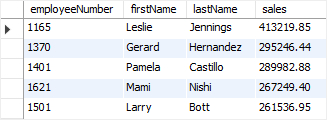

在本教程中，您将学习如何使用MySQL CTE或公用表表达式以更可读的方式构建复杂查询。

> 自*MySQL 8.0*版以来简要介绍了公共表表达式或叫*CTE*的功能，因此需要您在计算机上安装MySQL 8.0，以便在本教程中练习本语句。

## 1. 什么是公用表表达式或CTE？

公用表表达式是一个命名的临时结果集，仅在单个SQL语句(例如[SELECT](http://www.yiibai.com/mysql/select-statement-query-data.html)，[INSERT](http://www.yiibai.com/mysql/insert-statement.html)，[UPDATE](http://www.yiibai.com/mysql/update-data.html)或[DELETE](http://www.yiibai.com/mysql/delete-statement.html))的执行范围内存在。

与[派生表](http://www.yiibai.com/mysql/derived-table.html)类似，*CTE*不作为对象存储，仅在查询执行期间持续。 与派生表不同，*CTE*可以是自引用([递归CTE](http://www.yiibai.com/mysql/recursive-cte.html))，也可以在同一查询中多次引用。 此外，与派生表相比，*CTE*提供了更好的可读性和性能。

## 2. MySQL CTE语法

*CTE*的结构包括名称，可选列列表和定义*CTE*的查询。 定义*CTE*后，可以像`SELECT`，`INSERT`，`UPDATE`，`DELETE`或`CREATE VIEW`语句中的视图一样使用它。

以下说明了*CTE*的基本语法：

```sql
WITH cte_name (column_list) AS (
    query
) 
SELECT * FROM cte_name;
```

请注意，查询中的列数必须与`column_list`中的列数相同。 如果省略`column_list`，*CTE*将使用定义*CTE*的查询的列列表。

## 3. 简单的MySQL CTE示例

以下示例说明如何使用*CTE*查询[示例数据库(yiibaidb)](http://www.yiibai.com/mysql/sample-database.html)中的`customers`表中的数据。 请注意，此示例仅用于演示目的，以便您更容易地了解*CTE*概念。

```sql
WITH customers_in_usa AS (
    SELECT 
        customerName, state
    FROM
        customers
    WHERE
        country = 'USA'
) SELECT 
    customerName
 FROM
    customers_in_usa
 WHERE
    state = 'CA'
 ORDER BY customerName;
```

> 注意：上面语句只能在 *MySQL8.0* 以上版本才支持。

执行上面查询语句，得到以下结果(部分)


在此示例中，*CTE*的名称为`customers_in_usa`，定义*CTE*的查询返回两列：`customerName`和`state`。因此，`customers_in_usa` *CTE*返回位于美国的所有客户。

在定义美国*CTE*的客户之后，我们可在`SELECT`语句中引用它，例如，仅查询选择位于*California* 的客户。

参见另外一个例子：

```sql
WITH topsales2013 AS (
    SELECT 
        salesRepEmployeeNumber employeeNumber,
        SUM(quantityOrdered * priceEach) sales
    FROM
        orders
            INNER JOIN
        orderdetails USING (orderNumber)
            INNER JOIN
        customers USING (customerNumber)
    WHERE
        YEAR(shippedDate) = 2013
            AND status = 'Shipped'
    GROUP BY salesRepEmployeeNumber
    ORDER BY sales DESC
    LIMIT 5
)
SELECT 
    employeeNumber, firstName, lastName, sales
FROM
    employees
        JOIN
    topsales2013 USING (employeeNumber);
```

执行上面查询后，得到以下结果 -



在这个例子中，*CTE*中返回了在*2013*年前五名的销售代表。之后，我们引用了`topsales2013` CTE来获取有关销售代表的其他信息，包括名字和姓氏。

## 4. 更高级的MySQL CTE示例

请参阅以下示例：

```sql
WITH salesrep AS (
    SELECT 
        employeeNumber,
        CONCAT(firstName, ' ', lastName) AS salesrepName
    FROM
        employees
    WHERE
        jobTitle = 'Sales Rep'
),
customer_salesrep AS (
    SELECT 
        customerName, salesrepName
    FROM
        customers
            INNER JOIN
        salesrep ON employeeNumber = salesrepEmployeeNumber
)
SELECT 
    *
FROM
    customer_salesrep
ORDER BY customerName;
```

执行上面查询语句，得到以下结果 -


在这个例子中，在同一查询中有两个*CTE*。 第一个CTE(`salesrep`)获得职位是销售代表的员工。 第二个CTE(`customer_salesrep`)使用`INNER JOIN`子句与第一个*CTE*连接来获取每个销售代表负责的客户。

在使用第二个*CTE*之后，使用带有[ORDER BY](http://www.yiibai.com/mysql/order-by.html)子句的简单`SELECT`语句来查询来自该*CTE*的数据。

## 5. WITH子句用法

有一些上下文可以使用`WITH`子句来创建公用表表达式(*CTE*)：

**首先**，在`SELECT`，`UPDATE`和`DELETE`语句的开头可以使用`WITH`子句：

```sql
WITH ... SELECT ...
WITH ... UPDATE ...
WITH ... DELETE ...
```

**第二**，可以在子查询或派生表子查询的开头使用`WITH`子句：

```sql
SELECT ... WHERE id IN (WITH ... SELECT ...);

SELECT * FROM (WITH ... SELECT ...) AS derived_table;
```

**第三**，可以在`SELECT`语句之前立即使用`WITH`子句，包括`SELECT`子句：

```sql
CREATE TABLE ... WITH ... SELECT ...
CREATE VIEW ... WITH ... SELECT ...
INSERT ... WITH ... SELECT ...
REPLACE ... WITH ... SELECT ...
DECLARE CURSOR ... WITH ... SELECT ...
EXPLAIN ... WITH ... SELECT ...
```

在本教程中，您已经学会了如何使用MySQL 公共表表达式(*CTE*)来构造复杂的查询语句。