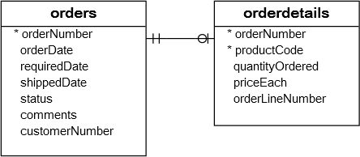

在本教程中，您将学习如何使用MySQL子查询编写复杂的查询语句并解释相关的子查询概念。

MySQL子查询是嵌套在另一个查询(如[SELECT](http://www.yiibai.com/mysql/select-statement-query-data.html)，[INSERT](http://www.yiibai.com/mysql/insert-statement.html)，[UPDATE](http://www.yiibai.com/mysql/update-data.html)或[DELETE](http://www.yiibai.com/mysql/delete-statement.html))中的查询。 另外，MySQL子查询可以嵌套在另一个子查询中。

MySQL子查询称为内部查询，而包含子查询的查询称为外部查询。 子查询可以在使用表达式的任何地方使用，并且必须在括号中关闭。

以下查询返回在位于美国(`USA`)的办公室工作的员工。

```sql
SELECT 
    lastName, firstName
FROM
    employees
WHERE
    officeCode IN (SELECT 
            officeCode
        FROM
            offices
        WHERE
            country = 'USA');
```

在这个例子中：

- 子查询返回位于美国的办公室的所有办公室代码。
- 外部查询选择在办公室代码在子查询返回的结果集中的办公室中工作的员工的姓氏和名字。


当查询执行时，首先执行子查询并返回一个结果集。然后，将此结果集作为外部查询的输入。

## 1. MySQL子查询在WHERE子句中

我们将使用[示例数据(yiibaidb)库](http://www.yiibai.com/mysql/sample-database.html)中的`payments`表进行演示。`payments`表的表结构如下 -

```sql
mysql> desc payments;
+----------------+---------------+------+-----+---------+-------+
| Field          | Type          | Null | Key | Default | Extra |
+----------------+---------------+------+-----+---------+-------+
| customerNumber | int(11)       | NO   | PRI | NULL    |       |
| checkNumber    | varchar(50)   | NO   | PRI | NULL    |       |
| paymentDate    | date          | NO   |     | NULL    |       |
| amount         | decimal(10,2) | NO   |     | NULL    |       |
+----------------+---------------+------+-----+---------+-------+
4 rows in set
```

**1.1 MySQL子查询与比较运算符**

可以使用比较运算符，例如`=`，`>`，`<`等将子查询返回的单个值与[WHERE](http://www.yiibai.com/mysql/where.html)子句中的表达式进行比较。

例如，以下查询返回最大付款额的客户。

```sql
SELECT 
    customerNumber, checkNumber, amount
FROM
    payments
WHERE
    amount = (SELECT 
            MAX(amount)
        FROM
            payments);
```

执行上面查询语句，得到以下结果 -

```sql
+----------------+-------------+-----------+
| customerNumber | checkNumber | amount    |
+----------------+-------------+-----------+
|            141 | JE105477    | 120166.58 |
+----------------+-------------+-----------+
```

除等式运算符之外，还可以使用大于(`>`)，小于(`<`)等的其他比较运算符。

例如，可以使用子查询找到其付款大于平均付款的客户。 首先，使用子查询来计算使用[AVG](http://www.yiibai.com/mysql/avg.html)聚合函数的平均付款。 然后，在外部查询中，查询大于子查询返回的平均付款的付款。参考以下查询语句的写法 -

```sql
SELECT 
    customerNumber, checkNumber, amount
FROM
    payments
WHERE
    amount > (SELECT 
            AVG(amount)
        FROM
            payments);
```

执行上面查询语句，得到以下结果 -

```sql
+----------------+-------------+-----------+
| customerNumber | checkNumber | amount    |
+----------------+-------------+-----------+
|            112 | HQ55022     | 32641.98  |
|            112 | ND748579    | 33347.88  |
|            114 | GG31455     | 45864.03  |
|            114 | MA765515    | 82261.22  |
|            114 | NR27552     | 44894.74  |
|            119 | LN373447    | 47924.19  |
|            119 | NG94694     | 49523.67  |
| 省略部分数据 .........................    |
|            484 | JH546765    | 47513.19  |
|            486 | HS86661     | 45994.07  |
|            495 | BH167026    | 59265.14  |
|            496 | MN89921     | 52166     |
+----------------+-------------+-----------+
134 rows in set
```

**1.2. 具有IN和NOT IN运算符的MySQL子查询**

如果子查询返回多个值，则可以在`WHERE`子句中使用[IN](http://www.yiibai.com/sql-in.html)或[NOT IN](http://www.yiibai.com/sql-in.html)运算符等其他运算符。

查看以下客户和订单表的ER结构图 -


例如，可以使用带有`NOT IN`运算符的子查询来查找没有下过任何订单的客户，如下所示：

```sql
SELECT 
    customerName
FROM
    customers
WHERE
    customerNumber NOT IN (SELECT DISTINCT
            customerNumber
        FROM
            orders);
```

执行上面查询，得到以下结果 -

```sql
+--------------------------------+
| customerName                   |
+--------------------------------+
| Havel & Zbyszek Co             |
| American Souvenirs Inc         |
| Porto Imports Co.              |
| Asian Shopping Network, Co     |
| Natrlich Autos                 |
| ANG Resellers                  |
| Messner Shopping Network       |
| Franken Gifts, Co              |
| BG&E Collectables              |
| Schuyler Imports               |
| Der Hund Imports               |
| Cramer Spezialitten, Ltd       |
| Asian Treasures, Inc.          |
| SAR Distributors, Co           |
| Kommission Auto                |
| Lisboa Souveniers, Inc         |
| Precious Collectables          |
| Stuttgart Collectable Exchange |
| Feuer Online Stores, Inc       |
| Warburg Exchange               |
| Anton Designs, Ltd.            |
| Mit Vergngen & Co.             |
| Kremlin Collectables, Co.      |
| Raanan Stores, Inc             |
+--------------------------------+
24 rows in set
```

## 3. FROM子句中的MySQL子查询

在FROM子句中使用子查询时，从子查询返回的结果集将用作[临时表](http://www.yiibai.com/mysql/temporary-table.html)。 该表称为[派生表](http://www.yiibai.com/mysql/derived-table.html)或物化子查询。

以下子查询将查找订单表中的[最大](http://www.yiibai.com/mysql/max-function.html)，[最小](http://www.yiibai.com/mysql/min.html)和[平均数](http://www.yiibai.com/mysql/avg.html)：

```sql
SELECT 
    MAX(items), MIN(items), FLOOR(AVG(items))
FROM
    (SELECT 
        orderNumber, COUNT(orderNumber) AS items
    FROM
        orderdetails
    GROUP BY orderNumber) AS lineitems;
```

执行上面查询，得到以下结果 -

```sql
+------------+------------+-------------------+
| MAX(items) | MIN(items) | FLOOR(AVG(items)) |
+------------+------------+-------------------+
|         18 |          1 | 9                 |
+------------+------------+-------------------+
1 row in set
```

## 4. MySQL相关子查询

在前面的例子中，注意到一个子查询是独立的。 这意味着您可以将子查询作为独立查询执行，例如：

```sql
SELECT 
    orderNumber, 
    COUNT(orderNumber) AS items
FROM
    orderdetails
GROUP BY orderNumber;
```

与独立子查询不同，相关子查询是使用外部查询中的数据的子查询。 换句话说，相关的子查询取决于外部查询。 对外部查询中的每一行对相关子查询进行一次评估。

在以下查询中，我们查询选择购买价格高于每个产品线中的产品的平均购买价格的产品。

```sql
SELECT 
    productname,
    buyprice
FROM
    products p1
WHERE
    buyprice > (SELECT 
            AVG(buyprice)
        FROM
            products
        WHERE
            productline = p1.productline);
```

执行上面查询，得到以下结果 -

```sql
+-----------------------------------------+----------+
| productname                             | buyprice |
+-----------------------------------------+----------+
| 1952 Alpine Renault 1300                | 98.58    |
| 1996 Moto Guzzi 1100i                   | 68.99    |
| 2003 Harley-Davidson Eagle Drag Bike    | 91.02    |
| 1972 Alfa Romeo GTA                     | 85.68    |
| 1962 LanciaA Delta 16V                  | 103.42   |
| 1968 Ford Mustang                       | 95.34    |
| 2001 Ferrari Enzo                       | 95.59    |
| ************ 此处省略了一大波数据 ****************** |
| American Airlines: B767-300             | 51.15    |
| America West Airlines B757-200          | 68.8     |
| ATA: B757-300                           | 59.33    |
| F/A 18 Hornet 1/72                      | 54.4     |
| The Titanic                             | 51.09    |
| The Queen Mary                          | 53.63    |
+-----------------------------------------+----------+
55 rows in set
```

对于变化的每一行产品线，每个产品线都会执行内部查询。 因此，平均购买价格也会改变。 外部查询仅筛选购买价格大于子查询中每个产品线的平均购买价格的产品。

## 5. MySQL子查询与EXISTS和NOT EXISTS

当子查询与[EXISTS](http://www.yiibai.com/mysql/exists.html)或[NOT EXISTS](http://www.yiibai.com/mysql/exists.html)运算符一起使用时，子查询返回一个布尔值为`TRUE`或`FALSE`的值。以下查询说明了与`EXISTS`运算符一起使用的子查询：

```sql
SELECT 
    *
FROM
    table_name
WHERE
    EXISTS( subquery );
```

在上面的查询中，如果子查询(`subquery`)有返回任何行，则`EXISTS`子查询返回`TRUE`，否则返回`FALSE`。

通常在相关子查询中使用`EXISTS`和`NOT EXISTS`。

下面我们来看看示例数据库(yiibaidb)中的`orders`和`orderDetails`表：



以下查询选择总额大于`60000`的销售订单。

```sql
SELECT 
    orderNumber, 
    SUM(priceEach * quantityOrdered) total
FROM
    orderdetails
        INNER JOIN
    orders USING (orderNumber)
GROUP BY orderNumber
HAVING SUM(priceEach * quantityOrdered) > 60000;
```

执行上面查询，得到以下结果 -

```sql
+-------------+----------+
| orderNumber | total    |
+-------------+----------+
|       10165 | 67392.85 |
|       10287 | 61402.00 |
|       10310 | 61234.67 |
+-------------+----------+
```

如上面所示，返回`3`行数据，这意味着有`3`个销售订单的总额大于`60000`。

可以使用上面的查询作为相关子查询，通过使用`EXISTS`运算符来查找至少有一个总额大于`60000`的销售订单的客户信息：

```sql
SELECT 
    customerNumber, 
    customerName
FROM
    customers
WHERE
    EXISTS( SELECT 
            orderNumber, SUM(priceEach * quantityOrdered)
        FROM
            orderdetails
                INNER JOIN
            orders USING (orderNumber)
        WHERE
            customerNumber = customers.customerNumber
        GROUP BY orderNumber
        HAVING SUM(priceEach * quantityOrdered) > 60000);
```

执行上面查询，得到以下结果 -

```sql
+----------------+-------------------------+
| customerNumber | customerName            |
+----------------+-------------------------+
|            148 | Dragon Souveniers, Ltd. |
|            259 | Toms Spezialitten, Ltd  |
|            298 | Vida Sport, Ltd         |
+----------------+-------------------------+
3 rows in set
```

在本教程中，我们向您演示了如何使用MySQL子查询和相关子查询来构建更复杂的查询。