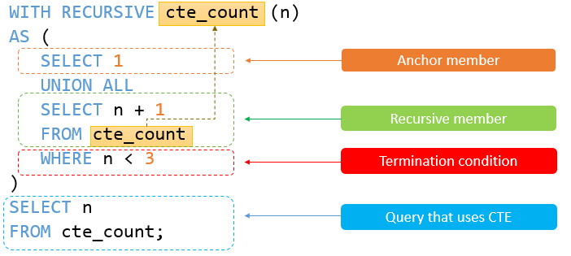
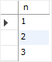
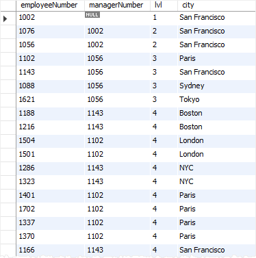

在本教程中，您将了解MySQL递归CTE(公共表表达式)以及如何使用它来遍历分层数据。

> 自*MySQL 8.0*版以来简要介绍了公共表表达式或叫*CTE*的功能，因此需要您在计算机上安装MySQL 8.0，以便在本教程中练习本语句。

## 1. MySQL递归CTE简介

递归[公用表表达式(CTE)](http://www.yiibai.com/mysql/cte.html)是一个具有引用*CTE*名称本身的子查询的*CTE*。以下说明递归*CTE*的语法 -

```sql
WITH RECURSIVE cte_name AS (
    initial_query  -- anchor member
    UNION ALL
    recursive_query -- recursive member that references to the CTE name
)
SELECT * FROM cte_name;
```

递归*CTE*由三个主要部分组成：

- 形成*CTE*结构的基本结果集的初始查询(*initial_query*)，初始查询部分被称为锚成员。
- 递归查询部分是引用*CTE*名称的查询，因此称为递归成员。递归成员由一个[UNION ALL](http://www.yiibai.com/sql-union-mysql.html)或`UNION DISTINCT`运算符与锚成员相连。
- 终止条件是当递归成员没有返回任何行时，确保递归停止。

递归*CTE*的执行顺序如下：

1. 首先，将成员分为两个：锚点和递归成员。
2. 接下来，执行锚成员形成基本结果集(`R0`)，并使用该基本结果集进行下一次迭代。
3. 然后，将`Ri`结果集作为输入执行递归成员，并将`Ri+1`作为输出。
4. 之后，重复第三步，直到递归成员返回一个空结果集，换句话说，满足终止条件。
5. 最后，使用`UNION ALL`运算符将结果集从`R0`到`Rn`组合。

## 2. 递归成员限制

递归成员不能包含以下结构：

- 聚合函数，如[MAX](http://www.yiibai.com/mysql/max-function.html)，[MIN](http://www.yiibai.com/mysql/min.html)，[SUM](http://www.yiibai.com/mysql/sum.html)，[AVG](http://www.yiibai.com/mysql/avg.html)，[COUNT](http://www.yiibai.com/mysql/count.html)等
- [GROUP BY](http://www.yiibai.com/mysql/group-by.html)子句
- [ORDER BY](http://www.yiibai.com/mysql/order-by.html)子句
- [LIMIT](http://www.yiibai.com/mysql/limit.html)子句
- [DISTINCT](http://www.yiibai.com/mysql/distinct.html)

请注意，上述约束不适用于锚定成员。 另外，只有在使用`UNION`运算符时，要禁止`DISTINCT`才适用。 如果使用`UNION DISTINCT`运算符，则允许使用`DISTINCT`。

另外，递归成员只能在其子句中引用*CTE*名称，而不是引用任何[子查询](http://www.yiibai.com/mysql/subquery.html)。

## 3. 简单的MySQL递归CTE示例

请参阅以下简单的递归*CTE* 示例：

```sql
WITH RECURSIVE cte_count (n) 
AS (
      SELECT 1
      UNION ALL
      SELECT n + 1 
      FROM cte_count 
      WHERE n < 3
    )
SELECT n 
FROM cte_count;
```

在此示例中，以下查询：

```sql
SELECT 1
```

是作为基本结果集返回`1`的锚成员。

以下查询 -

```sql
SELECT n + 1
FROM cte_count 
WHERE n < 3
```

是递归成员，因为它引用了`cte_count`的*CTE*名称。

递归成员中的表达式`<3`是终止条件。当`n`等于`3`，递归成员将返回一个空集合，将停止递归。

下图显示了上述*CTE*的元素：



递归**CTE**返回以下输出：



递归*CTE*的执行步骤如下：

- 首先，分离锚和递归成员。
- 接下来，锚定成员形成初始行(`SELECT 1`)，因此第一次迭代在`n = 1`时产生`1 + 1 = 2`。
- 然后，第二次迭代对第一次迭代的输出(`2`)进行操作，并且在`n = 2`时产生`2 + 1 = 3`。

1. 之后，在第三次操作(`n = 3`)之前，满足终止条件(`n <3`)，因此查询停止。
2. 最后，使用`UNION ALL`运算符组合所有结果集`1`,`2`和`3`。

## 4. 使用MySQL递归CTE遍历分层数据

我们将使用[示例数据库(yiibaidb)](http://www.yiibai.com/mysql/sample-database.html)中的`employees`表进行演示。

```sql
mysql> desc employees;
+----------------+--------------+------+-----+---------+-------+
| Field          | Type         | Null | Key | Default | Extra |
+----------------+--------------+------+-----+---------+-------+
| employeeNumber | int(11)      | NO   | PRI | NULL    |       |
| lastName       | varchar(50)  | NO   |     | NULL    |       |
| firstName      | varchar(50)  | NO   |     | NULL    |       |
| extension      | varchar(10)  | NO   |     | NULL    |       |
| email          | varchar(100) | NO   |     | NULL    |       |
| officeCode     | varchar(10)  | NO   | MUL | NULL    |       |
| reportsTo      | int(11)      | YES  | MUL | NULL    |       |
| jobTitle       | varchar(50)  | NO   |     | NULL    |       |
+----------------+--------------+------+-----+---------+-------+
8 rows in set
```

`employees`表具有引用`employeeNumber`字段的`reportsTo`字段。 `reportsTo`列存储经理的`ID`。总经理不会向公司的组织结构中的任何人报告，因此`reportsTo`列中的值为[NULL](http://www.yiibai.com/mysql/null.html)。

您可以应用递归*CTE*以自顶向下的方式查询整个组织结构，如下所示：

```sql
WITH RECURSIVE employee_paths AS
  ( SELECT employeeNumber,
           reportsTo managerNumber,
           officeCode, 
           1 lvl
   FROM employees
   WHERE reportsTo IS NULL
     UNION ALL
     SELECT e.employeeNumber,
            e.reportsTo,
            e.officeCode,
            lvl+1
     FROM employees e
     INNER JOIN employee_paths ep ON ep.employeeNumber = e.reportsTo )
SELECT employeeNumber,
       managerNumber,
       lvl,
       city
FROM employee_paths ep
INNER JOIN offices o USING (officeCode)
ORDER BY lvl, city;
```

让我们将查询分解成更小的部分，使其更容易理解。
**首先**，使用以下查询形成锚成员：

```sql
SELECT 
    employeeNumber, reportsTo managerNumber, officeCode
FROM
    employees
WHERE
    reportsTo IS NULL
```

此查询(锚成员)返回`reportTo`为`NULL`的总经理。

**其次**，通过引用*CTE*名称来执行递归成员，在这个示例中为 `employee_paths`：

```sql
SELECT 
    e.employeeNumber, e.reportsTo, e.officeCode
FROM
    employees e
        INNER JOIN
    employee_paths ep ON ep.employeeNumber = e.reportsTo
```

此查询(递归成员)返回经理的所有直接上级，直到没有更多的直接上级。 如果递归成员不返回直接上级，则递归停止。

**第三**，使用`employee_paths`的查询将*CTE*返回的结果集与`offices`表结合起来，以得到最终结果集合。

以下是查询的输出：



在本教程中，您已经了解了MySQL递归*CTE*以及如何使用它来遍历分层数据。