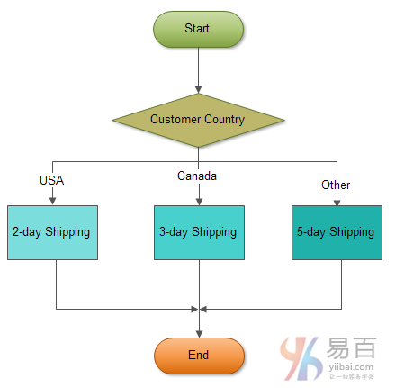

在本教程中，您将学习如何使用MySQL `CASE`语句在存储的程序中构造复杂的条件语句。

除了[IF语句](http://www.yiibai.com/mysql/if-statement.html)，MySQL提供了一个替代的条件语句`CASE`。 MySQL `CASE`语句使代码更加可读和高效。

`CASE`语句有两种形式：简单的搜索`CASE`语句。

## 简单CASE语句

我们来看一下简单`CASE`语句的语法：

```sql
CASE  case_expression
   WHEN when_expression_1 THEN commands
   WHEN when_expression_2 THEN commands
   ...
   ELSE commands
END CASE;
```

您可以使用简单`CASE`语句来检查表达式的值与一组唯一值的匹配。

`case_expression`可以是任何有效的表达式。我们将`case_expression`的值与每个`WHEN`子句中的`when_expression`进行比较，例如`when_expression_1`，`when_expression_2`等。如果`case_expression`和`when_expression_n`的值相等，则执行相应的`WHEN`分支中的命令(`commands`)。

如果`WHEN`子句中的`when_expression`与`case_expression`的值匹配，则`ELSE`子句中的命令将被执行。`ELSE`子句是可选的。 如果省略`ELSE`子句，并且找不到匹配项，MySQL将引发错误。

以下示例说明如何使用简单的`CASE`语句：

```sql
DELIMITER $$

CREATE PROCEDURE GetCustomerShipping(
 in  p_customerNumber int(11), 
 out p_shiping        varchar(50))
BEGIN
    DECLARE customerCountry varchar(50);

    SELECT country INTO customerCountry
 FROM customers
 WHERE customerNumber = p_customerNumber;

    CASE customerCountry
 WHEN  'USA' THEN
    SET p_shiping = '2-day Shipping';
 WHEN 'Canada' THEN
    SET p_shiping = '3-day Shipping';
 ELSE
    SET p_shiping = '5-day Shipping';
 END CASE;

END$$
```

上面存储过程是如何工作的？

- `GetCustomerShipping`存储过程接受客户编号作为`IN`[参数](http://www.yiibai.com/mysql/stored-procedures-parameters.html)，并根据客户所在国家返回运送时间。
- 在存储过程中，首先，我们根据输入的客户编号得到客户的国家。然后使用简单`CASE`语句来比较客户的国家来确定运送期。如果客户位于美国(`USA`)，则运送期为`2`天。 如果客户在加拿大，运送期为`3`天。 来自其他国家的客户则需要`5`天的运输时间。

以下流程图显示了确定运输时间的逻辑。



以下是上述存储过程的测试脚本：

```sql
SET @customerNo = 112;

SELECT country into @country
FROM customers
WHERE customernumber = @customerNo;

CALL GetCustomerShipping(@customerNo,@shipping);

SELECT @customerNo AS Customer,
       @country    AS Country,
       @shipping   AS Shipping;
```

执行上面代码，得到以下结果 -

```sql
+----------+---------+----------------+
| Customer | Country | Shipping       |
+----------+---------+----------------+
|      112 | USA     | 2-day Shipping |
+----------+---------+----------------+
1 row in set
```

## 可搜索CASE语句

简单`CASE`语句仅允许您将表达式的值与一组不同的值进行匹配。 为了执行更复杂的匹配，如范围，您可以使用可搜索`CASE`语句。 可搜索`CASE`语句等同于`IF`语句，但是它的构造更加可读。

以下说明可搜索`CASE`语句的语法：

```sql
CASE
    WHEN condition_1 THEN commands
    WHEN condition_2 THEN commands
    ...
    ELSE commands
END CASE;
```

MySQL评估求值`WHEN`子句中的每个条件，直到找到一个值为`TRUE`的条件，然后执行`THEN`子句中的相应命令(`commands`)。

如果没有一个条件为`TRUE`，则执行`ELSE`子句中的命令(`commands`)。如果不指定`ELSE`子句，并且没有一个条件为`TRUE`，MySQL将发出错误消息。

MySQL不允许在`THEN`或`ELSE`子句中使用空的命令。 如果您不想处理`ELSE`子句中的逻辑，同时又要防止MySQL引发错误，则可以在`ELSE`子句中放置一个空的`BEGIN END`块。

以下示例演示如何使用可搜索`CASE`语句来根据客户的信用额度来查找客户级：`SILVER`，`GOLD`或`PLATINUM`。

```sql
DELIMITER $$

CREATE PROCEDURE GetCustomerLevel(
 in  p_customerNumber int(11), 
 out p_customerLevel  varchar(10))
BEGIN
    DECLARE creditlim double;

    SELECT creditlimit INTO creditlim
 FROM customers
 WHERE customerNumber = p_customerNumber;

    CASE  
 WHEN creditlim > 50000 THEN 
    SET p_customerLevel = 'PLATINUM';
 WHEN (creditlim <= 50000 AND creditlim >= 10000) THEN
    SET p_customerLevel = 'GOLD';
 WHEN creditlim < 10000 THEN
    SET p_customerLevel = 'SILVER';
 END CASE;

END$$
```

在上面查询语句逻辑中，如果信用额度是：

- 大于`50K`，则客户是`PLATINUM`客户。
- 小于`50K`，大于`10K`，则客户是`GOLD`客户。
- 小于`10K`，那么客户就是`SILVER`客户。

我们可以通过执行以下测试脚本来测试存储过程：

```sql
CALL GetCustomerLevel(112,@level);
SELECT @level AS 'Customer Level';
```

执行上面查询语句，得到以下结果 -

```sql
+----------------+
| Customer Level |
+----------------+
| PLATINUM       |
+----------------+
1 row in set
```

在本教程中，我们向您展示了如何使用两种形式的MySQL `CASE`语句，包括简单`CASE`语句和可搜索`CASE`语句。