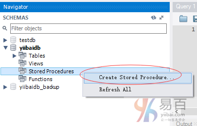
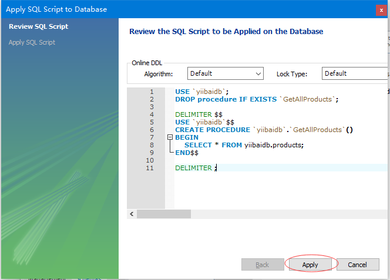
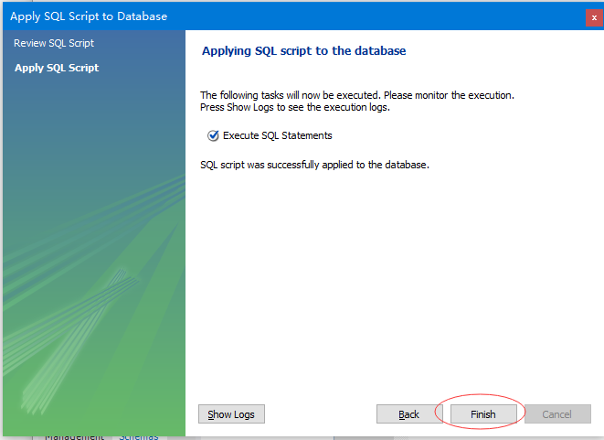
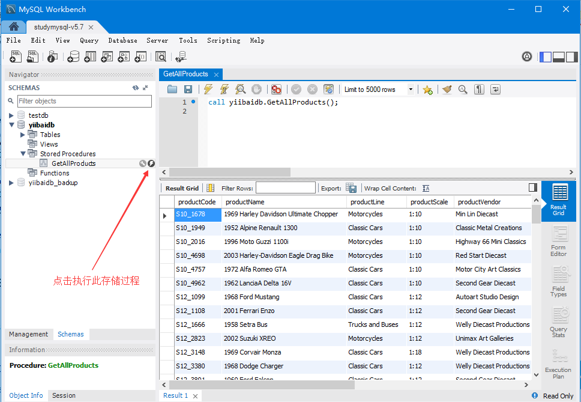

在本教程中，我们将逐步介绍如何使用`CREATE PROCEDURE`语句开发第一个MySQL存储过程。 另外，我们将向您展示如何从SQL语句调用存储过程。

## 编写第一个MySQL存储过程

我们将开发一个名为`GetAllProducts()`的简单[存储过程](http://www.yiibai.com/introduction-to-sql-stored-procedures.html)来帮助您熟悉创建存储过程的语法。 `GetAllProducts()`存储过程从`products`表中选择所有产品。

启动 *mysql* 客户端工具并键入以下命令：

```sql
DELIMITER //
 CREATE PROCEDURE GetAllProducts()
   BEGIN
   SELECT *  FROM products;
   END //
DELIMITER ;
```

让我们来详细地说明上述存储过程：

- 第一个命令是`DELIMITER //`，它与存储过程语法无关。 `DELIMITER`语句将标准分隔符 - 分号(`;`)更改为：`//`。 在这种情况下，分隔符从分号(`;`)更改为双斜杠`//`。为什么我们必须更改分隔符？ 因为我们想将存储过程作为整体传递给服务器，而不是让mysql工具一次解释每个语句。 在`END`关键字之后，使用分隔符`//`来指示存储过程的结束。 最后一个命令(`DELIMITER;`)将分隔符更改回分号(`;`)。
- 使用`CREATE PROCEDURE`语句创建一个新的存储过程。在`CREATE PROCEDURE`语句之后指定存储过程的名称。在这个示例中，存储过程的名称为：`GetAllProducts`，并把括号放在存储过程的名字之后。
- `BEGIN`和`END`之间的部分称为存储过程的主体。将声明性SQL语句放在主体中以处理业务逻辑。 在这个存储过程中，我们使用一个简单的[SELECT语句](http://www.yiibai.com/mysql/select-statement-query-data.html)来查询`products`表中的数据。

在mysql客户端工具中编写存储过程非常繁琐，特别是当存储过程复杂时。 大多数用于MySQL的GUI工具允许您通过直观的界面创建新的存储过程。

例如，在*MySQL Workbench*中，您可以如下创建一个新的存储过程：

**首先**，右键单击*Stored Procedures…*并选择“*Create Stored Procedure…*”菜单项。



**接下来**，编写存储过程代码，然后单击*Apply*按钮

```sql
CREATE PROCEDURE `yiibaidb`.`GetAllProducts`()
BEGIN
    SELECT * FROM yiibaidb.products;
END
```

**然后**，您可以在MySQL将其存储在数据库中之前查看代码。如果一切都没有问题，点击*Apply*按钮。如下所示 -



**之后**，MySQL将存储过程编译并放入数据库目录中; 单击*Fished*按钮完成。



最后，可以在`yiibaidb`数据库的例程下看到上面所创建的新存储过程。如下图所示 -


到此，我们已经成功地创建了一个存储过程。下面我们将学习如何使用它。

## 调用存储过程

要调用存储过程，可以使用以下SQL命令：

```sql
CALL STORED_PROCEDURE_NAME();
```

使用`CALL`语句调用存储过程，例如调用`GetAllProducts()`存储过程，则使用以下语句：

```sql
CALL GetAllProducts();
```

如果您执行上述语句，将查询获得`products`表中的所有产品。如下图所示 -



在本教程中，您已经学习了如何使用`CREATE PROCEDURE`语句编写一个简单的存储过程，并使用`CALL`语句从SQL语句中调用它。