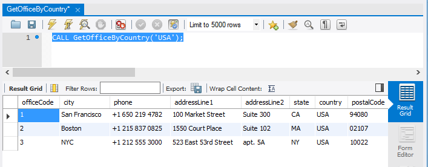

在本教程中，您将学习如何编写具有参数的MySQL[存储过程](http://www.yiibai.com/mysql/stored-procedure.html)。还将通过几个存储过程示例来了解不同类型的参数。

## MySQL存储过程参数简介

在现实应用中，开发的存储过程几乎都需要参数。这些参数使存储过程更加灵活和有用。 在MySQL中，参数有三种模式：`IN`，`OUT`或`INOUT`。

- `IN` - 是默认模式。在存储过程中定义`IN`参数时，调用程序必须将参数传递给存储过程。 另外，`IN`参数的值被保护。这意味着即使在存储过程中更改了`IN`参数的值，在存储过程结束后仍保留其原始值。换句话说，存储过程只使用`IN`参数的副本。
- `OUT` - 可以在存储过程中更改`OUT`参数的值，并将其更改后新值传递回调用程序。请注意，存储过程在启动时无法访问`OUT`参数的初始值。
- `INOUT` - `INOUT`参数是`IN`和`OUT`参数的组合。这意味着调用程序可以传递参数，并且存储过程可以修改`INOUT`参数并将新值传递回调用程序。

在存储过程中定义参数的语法如下：

```sql
MODE param_name param_type(param_size)
```

上面语法说明如下 -

- 根据存储过程中参数的目的，`MODE`可以是`IN`，`OUT`或`INOUT`。
- `param_name`是参数的名称。参数的名称必须遵循MySQL中列名的命名规则。
- 在参数名之后是它的数据类型和大小。和[变量](http://www.yiibai.com/variables-in-stored-procedures.html)一样，参数的数据类型可以是任何有效的[MySQL数据类型](http://www.yiibai.com/mysql/data-types.html)。

如果存储过程有多个参数，则每个参数由逗号(`,`)分隔。

让我们练习一些例子来更好的理解。 我们将使用[示例数据库(yiibaidb)](http://www.yiibai.com/mysql/sample-database.html)中的表进行演示。

## MySQL存储过程参数示例

**1.IN参数示例**

以下示例说明如何使用`GetOfficeByCountry`存储过程中的`IN`参数来查询选择位于特定国家/地区的办公室。

```sql
USE `yiibaidb`;
DROP procedure IF EXISTS `GetOfficeByCountry`;

DELIMITER $$
USE `yiibaidb`$$
CREATE PROCEDURE GetOfficeByCountry(IN countryName VARCHAR(255))
 BEGIN
 SELECT * 
 FROM offices
 WHERE country = countryName;
 END$$

DELIMITER ;
```

`countryName`是存储过程的IN参数。在存储过程中，我们查询位于`countryName`参数指定的国家/地区的所有办公室。

假设我们想要查询在美国(`USA`)的所有办事处，我们只需要将一个值(`USA`)传递给存储过程，如下所示：

```sql
CALL GetOfficeByCountry('USA');
```

执行上面查询语句，得到以下结果 -



要在法国获得所有办事处，我们将`France`字符串传递给`GetOfficeByCountry`存储过程，如下所示：

```sql
CALL GetOfficeByCountry('France')
```

**2.OUT参数示例**

以下存储过程通过订单状态返回订单数量。它有两个参数：

- `orderStatus`：`IN`参数，它是要对订单计数的订单状态。
- `total`：存储指定订单状态的订单数量的`OUT`参数。

以下是`CountOrderByStatus`存储过程的源代码。

```sql
USE `yiibaidb`;
DROP procedure IF EXISTS `CountOrderByStatus`;

DELIMITER $$
CREATE PROCEDURE CountOrderByStatus(
 IN orderStatus VARCHAR(25),
 OUT total INT)
BEGIN
 SELECT count(orderNumber)
 INTO total
 FROM orders
 WHERE status = orderStatus;
END$$
DELIMITER ;
```

要获取发货订单的数量，我们调用`CountOrderByStatus`存储过程，并将订单状态传递为已发货，并传递参数(`@total`)以获取返回值。

```sql
CALL CountOrderByStatus('Shipped',@total);
SELECT @total;
```

执行上面查询语句后，得到以下结果 -

```sql
+--------+
| @total |
+--------+
|    303 |
+--------+
1 row in set
```

要获取正在处理的订单数量，调用`CountOrderByStatus`存储过程，如下所示：

执行上面查询语句后，得到以下结果 -

```sql
+------------------+
| total_in_process |
+------------------+
|                7 |
+------------------+
1 row in set
```

## INOUT参数示例

以下示例演示如何在存储过程中使用`INOUT`参数。如下查询语句 -

```sql
DELIMITER $$
CREATE PROCEDURE set_counter(INOUT count INT(4),IN inc INT(4))
BEGIN
 SET count = count + inc;
END$$
DELIMITER ;
```

上面查询语句是如何运行的？

- `set_counter`存储过程接受一个`INOUT`参数(`count`)和一个`IN`参数(`inc`)。
- 在存储过程中，通过`inc`参数的值增加计数器(`count`)。

下面来看看如何调用`set_counter`存储过程：

```sql
SET @counter = 1;
CALL set_counter(@counter,1); -- 2
CALL set_counter(@counter,1); -- 3
CALL set_counter(@counter,5); -- 8
SELECT @counter; -- 8
```

在本教程中，我们向您展示了如何在存储过程中定义参数，并介绍了不同的参数模式：`IN`，`OUT`和`INOUT`。