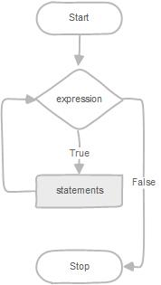
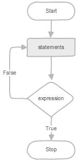

在本教程中，将学习如何使用各种MySQL循环语句(包括`WHILE`，`REPEAT`和`LOOP`)来根据条件反复运行代码块。

MySQL提供循环语句，允许您根据条件重复执行一个SQL代码块。 MySQL中有三个循环语句：`WHILE`，`REPEAT`和`LOOP`。

我们将在以下部分中更详细地检查每个循环语句。

## WHILE循环

`WHILE`语句的语法如下：

```sql
WHILE expression DO
   statements
END WHILE
```

`WHILE`循环在每次迭代开始时检查表达式。 如果`expressionevaluates`为`TRUE`，MySQL将执行`WHILE`和`END WHILE`之间的语句，直到`expressionevaluates`为`FALSE`。 `WHILE`循环称为预先测试条件循环，因为它总是在执行前检查语句的表达式。

下面的流程图说明了`WHILE`循环语句：



以下是在存储过程中使用`WHILE`循环语句的示例：

```sql
DELIMITER $$
 DROP PROCEDURE IF EXISTS test_mysql_while_loop$$
 CREATE PROCEDURE test_mysql_while_loop()
 BEGIN
 DECLARE x  INT;
 DECLARE str  VARCHAR(255);

 SET x = 1;
 SET str =  '';

 WHILE x  <= 5 DO
 SET  str = CONCAT(str,x,',');
 SET  x = x + 1; 
 END WHILE;

 SELECT str;
 END$$
DELIMITER ;
```

在上面的`test_mysql_while_loop`存储过程中：

- 首先，重复构建`str`字符串，直到`x`[变量](http://www.yiibai.com/mysql/variables-in-stored-procedures.html)的值大于`5`。
- 然后，使用[SELECT语句](http://www.yiibai.com/mysql/select-statement-query-data.html)显示最终的字符串。

*要注意*，如果不初始化`x`变量的值，那么它默认值为`NULL`。 因此，`WHILE`循环语句中的条件始终为`TRUE`，并且您将有一个不确定的循环，这是不可预料的。

下面来测试`test_mysql_while_loopstored`调用存储过程：

```sql
CALL test_mysql_while_loop();
```

执行上面查询语句，得到以下结果 -

```sql
mysql> CALL test_mysql_while_loop();
+------------+
| str        |
+------------+
| 1,2,3,4,5, |
+------------+
1 row in set

Query OK, 0 rows affected
```

## REPEAT循环

`REPEAT`循环语句的语法如下：

```sql
REPEAT
 statements;
UNTIL expression
END REPEAT
```

首先，MySQL执行语句，然后评估求值表达式(`expression`)。如果表达式(`expression`)的计算结果为`FALSE`，则MySQL将重复执行该语句，直到该表达式计算结果为`TRUE`。

因为`REPEAT`循环语句在执行语句后检查表达式(`expression`)，因此`REPEAT`循环语句也称为测试后循环。

下面的流程图说明了`REPEAT`循环语句的执行过程：



我们可以使用`REPEAT`循环语句重写`test_mysql_while_loop`存储过程，使用`WHILE`循环语句：

```sql
DELIMITER $$
 DROP PROCEDURE IF EXISTS mysql_test_repeat_loop$$
 CREATE PROCEDURE mysql_test_repeat_loop()
 BEGIN
 DECLARE x INT;
 DECLARE str VARCHAR(255);

 SET x = 1;
        SET str =  '';

 REPEAT
 SET  str = CONCAT(str,x,',');
 SET  x = x + 1; 
        UNTIL x  > 5
        END REPEAT;

        SELECT str;
 END$$
DELIMITER ;
```

要注意的是`UNTIL`表达式中没有分号(`;`)。

执行上面查询语句，得到以下结果 -

```sql
mysql> CALL mysql_test_repeat_loop();
+------------+
| str        |
+------------+
| 1,2,3,4,5, |
+------------+
1 row in set

Query OK, 0 rows affected
```

## LOOP，LEAVE和ITERATE语句

有两个语句允许您用于控制循环：

- `LEAVE`语句用于立即退出循环，而无需等待检查条件。`LEAVE`语句的工作原理就类似[PHP](http://www.yiibai.com/php/)，`C/C++`，[Java](http://www.yiibai.com/java/)等其他语言的`break`语句一样。
- `ITERATE`语句允许您跳过剩下的整个代码并开始新的迭代。`ITERATE`语句类似于`PHP`，`C/C++`，`Java`等中的`continue`语句。

MySQL还有一个`LOOP`语句，它可以反复执行一个代码块，另外还有一个使用循环标签的灵活性。

以下是使用`LOOP`循环语句的示例。

```sql
CREATE PROCEDURE test_mysql_loop()
 BEGIN
 DECLARE x  INT;
        DECLARE str  VARCHAR(255);

 SET x = 1;
        SET str =  '';

 loop_label:  LOOP
 IF  x > 10 THEN 
 LEAVE  loop_label;
 END  IF;

 SET  x = x + 1;
 IF (x mod 2) THEN
     ITERATE  loop_label;
 ELSE
    SET  str = CONCAT(str,x,',');
 END IF;
    END LOOP;    
    SELECT str;
END;
```

- 以上存储过程仅构造具有偶数字符串的字符串，例如`2`,`4`,`6`等。
- 在`LOOP`语句之前放置一个`loop_label`循环标签。
- 如果`x`的值大于`10`，则由于`LEAVE`语句，循环被终止。
- 如果`x`的值是一个奇数，`ITERATE`语句忽略它下面的所有内容，并开始一个新的迭代。
- 如果`x`的值是偶数，则`ELSE`语句中的块将使用偶数构建字符串。

执行上面查询语句，得到以下结果 -

```sql
mysql> CALL test_mysql_loop();
+-------------+
| str         |
+-------------+
| 2,4,6,8,10, |
+-------------+
1 row in set

Query OK, 0 rows affected
```

在本教程中，您学习了基于条件重复执行代码块的各种MySQL循环语句。