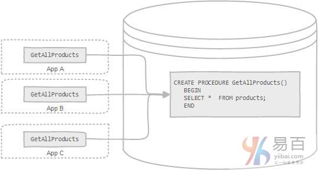

在本教程中，您将学习MySQL存储过程什么以及其相关概念，并了解MySQL存储过的优缺点。

## 存储过程的定义

存储过程是存储在数据库目录中的一段声明性SQL语句。 [触发器](http://www.yiibai.com/mysql/triggers.html)，其他存储过程以及[Java](http://www.yiibai.com/jdbc/%22Java%22)，[Python](http://www.yiibai.com/python/)，[PHP](http://www.yiibai.com/php/)等应用程序可以调用存储过程。

自身的存储过程称为递归存储过程。大多数数据库管理系统支持递归存储过程。 但是，MySQL不支持它。 在MySQL中实现递归存储过程之前，您应该检查MySQL数据库的版本。

## 在MySQL中存储过程

MySQL是最受欢迎的开源RDBMS，被社区和企业广泛使用。 然而，在它发布的第一个十年期间，它不支持存储过程，[存储函数](http://www.yiibai.com/mysql/stored-function.html)，[触发器](http://www.yiibai.com/mysql/triggers.html)和[事件](http://www.yiibai.com/mysql/triggers/working-mysql-scheduled-event.html)。自从*MySQL 5.0*版本以来，这些功能被添加到MySQL数据库引擎，使其更加灵活和强大。

## MySQL存储过程的优点

- 通常存储过程有助于提高应用程序的性能。当创建，存储过程被编译之后，就存储在数据库中。 但是，MySQL实现的存储过程略有不同。 MySQL存储过程按需编译。 在编译存储过程之后，MySQL将其放入缓存中。 MySQL为每个连接维护自己的存储过程高速缓存。 如果应用程序在单个连接中多次使用存储过程，则使用编译版本，否则存储过程的工作方式类似于查询。
- 存储过程有助于减少应用程序和数据库服务器之间的流量，因为应用程序不必发送多个冗长的SQL语句，而只能发送存储过程的名称和参数。
- 存储的程序对任何应用程序都是可重用的和透明的。 存储过程将数据库接口暴露给所有应用程序，以便开发人员不必开发存储过程中已支持的功能。
- 存储的程序是安全的。 数据库管理员可以向访问数据库中存储过程的应用程序授予适当的权限，而不向基础数据库表提供任何权限。

除了这些优点之外，存储过程有其自身的缺点，在数据库中使用它们之前，您应该注意这些缺点。

## MySQL存储过程的缺点

- 如果使用大量存储过程，那么使用这些存储过程的每个连接的内存使用量将会大大增加。 此外，如果您在存储过程中过度使用大量逻辑操作，则CPU使用率也会增加，因为数据库服务器的设计不当于逻辑运算。
- 存储过程的构造使得开发具有复杂业务逻辑的存储过程变得更加困难。
- 很难调试存储过程。只有少数数据库管理系统允许您调试存储过程。不幸的是，MySQL不提供调试存储过程的功能。
- 开发和维护存储过程并不容易。开发和维护存储过程通常需要一个不是所有应用程序开发人员拥有的专业技能。这可能会导致应用程序开发和维护阶段的问题。

MySQL存储过程有自己的优点和缺点。开发应用程序时，您应该决定是否应该或不应该根据业务需求使用存储过程。

在下面的教程中，我们将向您展示如何在数据库编程任务中利用MySQL存储过程与许多实际示例。