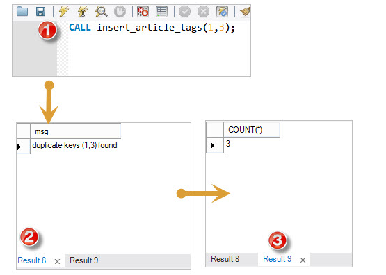
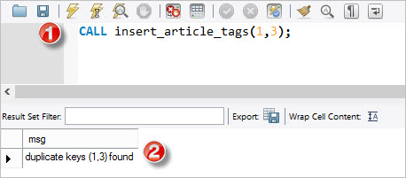

本教程将向您展示如何使用MySQL处理程序来处理在存储过程中遇到的异常或错误。

当存储过程中发生错误时，重要的是适当处理它，例如：继续或退出当前代码块的执行，并发出有意义的错误消息。

MySQL提供了一种简单的方法来定义处理从一般条件(如警告或异常)到特定条件(例如特定错误代码)的处理程序。

## 声明处理程序

要声明一个处理程序，您可以使用`DECLARE HANDLER`语句如下：

```sql
DECLARE action HANDLER FOR condition_value statement;
```

如果条件的值与`condition_value`匹配，则MySQL将执行`statement`，并根据该操作继续或退出当前的代码块。

操作(`action`)接受以下值之一：

- `CONTINUE`：继续执行封闭代码块(`BEGIN ... END`)。
- `EXIT`：处理程序声明封闭代码块的执行终止。

`condition_value`指定一个特定条件或一类激活处理程序的条件。`condition_value`接受以下值之一：

- 一个MySQL错误代码。
- 标准`SQLSTATE`值或者它可以是`SQLWARNING`，`NOTFOUND`或`SQLEXCEPTION`条件，这是`SQLSTATE`值类的简写。`NOTFOUND`条件用于游标或`SELECT INTO variable_list`语句。
- 与MySQL错误代码或`SQLSTATE`值相关联的命名条件。

该语句可以是一个简单的语句或由`BEGIN`和`END`关键字包围的复合语句。

## MySQL错误处理示例

我们来看几个声明处理程序的例子。

以下处理程序意味着如果发生错误，则将`has_error`变量的值设置为`1`并继续执行。

```sql
DECLARE CONTINUE HANDLER FOR SQLEXCEPTION SET has_error = 1;
```

以下是另一个处理程序，如果发生错误，回滚上一个操作，发出错误消息，并退出当前代码块。 如果在存储过程的`BEGIN END`块中声明它，则会立即终止存储过程。

```sql
DECLARE EXIT HANDLER FOR SQLEXCEPTION
BEGIN
ROLLBACK;
SELECT 'An error has occurred, operation rollbacked and the stored procedure was terminated';
END;
```

以下处理程序如果没有更多的行要提取，在[光标](http://www.yiibai.com/mysql/cursor.html)或[SELECT INTO](http://www.yiibai.com/mysql/select-statement-query-data.html)语句的情况下，将`no_row_found`变量的值设置为`1`并继续执行。

```sql
DECLARE CONTINUE HANDLER FOR NOT FOUND SET no_row_found = 1;
```

以下处理程序如果发生重复的键错误，则会发出MySQL错误`1062`。 它发出错误消息并继续执行。

```sql
DECLARE CONTINUE HANDLER FOR 1062
SELECT 'Error, duplicate key occurred';
```

## 存储过程中的MySQL处理程序示例

首先，为了更好地演示，我们[创建](http://www.yiibai.com/mysql/create-table.html)一个名为`article_tags`的新表：

```sql
USE testdb;
CREATE TABLE article_tags(
    article_id INT,
    tag_id     INT,
    PRIMARY KEY(article_id,tag_id)
);
```

`article_tags`表存储文章和标签之间的关系。每篇文章可能有很多标签，反之亦然。 为了简单起见，我们不会在`article_tags`表中创建文章(`article`)表和标签(`tags`)表以及[外键](http://www.yiibai.com/mysql/foreign-key.html)。

接下来，创建一个[存储过程](http://www.yiibai.com/mysql/getting-started-with-mysql-stored-procedures.html)，将文章的`id`和标签的`id`插入到`article_tags`表中：

```sql
USE testdb;
DELIMITER $$

CREATE PROCEDURE insert_article_tags(IN article_id INT, IN tag_id INT)
BEGIN

 DECLARE CONTINUE HANDLER FOR 1062
 SELECT CONCAT('duplicate keys (',article_id,',',tag_id,') found') AS msg;

 -- insert a new record into article_tags
 INSERT INTO article_tags(article_id,tag_id)
 VALUES(article_id,tag_id);

 -- return tag count for the article
 SELECT COUNT(*) FROM article_tags;
END$$
DELIMITER ;
```

然后，通过调用`insert_article_tags`存储过程，为文章ID为`1`添加标签ID：`1`,`2`和`3`，如下所示：

```sql
CALL insert_article_tags(1,1);
CALL insert_article_tags(1,2);
CALL insert_article_tags(1,3);
```

之后，尝试插入一个重复的键来检查处理程序是否真的被调用。

```sql
CALL insert_article_tags(1,3);
```

执行上面查询语句，得到以下结果 -

```sql
mysql> CALL insert_article_tags(1,3);
+----------------------------+
| msg                        |
+----------------------------+
| duplicate keys (1,3) found |
+----------------------------+
1 row in set

+----------+
| COUNT(*) |
+----------+
|        3 |
+----------+
1 row in set

Query OK, 0 rows affected
```

执行后会收到一条错误消息。 但是，由于我们将处理程序声明为`CONTINUE`处理程序，所以存储过程继续执行。因此，最后获得了文章的标签计数值为：`3`。



如果将处理程序声明中的`CONTINUE`更改为`EXIT`，那么将只会收到一条错误消息。如下查询语句 -

```sql
DELIMITER $$

CREATE PROCEDURE insert_article_tags_exit(IN article_id INT, IN tag_id INT)
BEGIN

 DECLARE EXIT HANDLER FOR SQLEXCEPTION 
 SELECT 'SQLException invoked';

 DECLARE EXIT HANDLER FOR 1062 
        SELECT 'MySQL error code 1062 invoked';

 DECLARE EXIT HANDLER FOR SQLSTATE '23000'
 SELECT 'SQLSTATE 23000 invoked';

 -- insert a new record into article_tags
 INSERT INTO article_tags(article_id,tag_id)
   VALUES(article_id,tag_id);

 -- return tag count for the article
 SELECT COUNT(*) FROM article_tags;
END $$
DELIMITER ;
```

执行上面查询语句，得到以下结果 -

```sql
mysql> CALL insert_article_tags_exit(1,3);
+-------------------------------+
| MySQL error code 1062 invoked |
+-------------------------------+
| MySQL error code 1062 invoked |
+-------------------------------+
1 row in set

Query OK, 0 rows affected
```



## MySQL处理程序优先级

如果使用多个处理程序来处理错误，MySQL将调用最特定的处理程序来处理错误。

错误总是映射到一个MySQL错误代码，因为在MySQL中它是最具体的。 `SQLSTATE`可以映射到许多MySQL错误代码，因此它不太具体。 `SQLEXCPETION`或`SQLWARNING`是`SQLSTATES`类型值的缩写，因此它是最通用的。

假设在`insert_article_tags_3`存储过程中声明三个处理程序，如下所示：

```sql
DELIMITER $$

CREATE PROCEDURE insert_article_tags_3(IN article_id INT, IN tag_id INT)
BEGIN

 DECLARE EXIT HANDLER FOR 1062 SELECT 'Duplicate keys error encountered';
 DECLARE EXIT HANDLER FOR SQLEXCEPTION SELECT 'SQLException encountered';
 DECLARE EXIT HANDLER FOR SQLSTATE '23000' SELECT 'SQLSTATE 23000';

 -- insert a new record into article_tags
 INSERT INTO article_tags(article_id,tag_id)
 VALUES(article_id,tag_id);

 -- return tag count for the article
 SELECT COUNT(*) FROM article_tags;
END $$
DELIMITER ;
```

我们尝试通过调用存储过程将重复的键插入到`article_tags`表中：

```sql
CALL insert_article_tags_3(1,3);
```

如下，可以看到MySQL错误代码处理程序被调用。

```sql
mysql> CALL insert_article_tags_3(1,3);
+----------------------------------+
| Duplicate keys error encountered |
+----------------------------------+
| Duplicate keys error encountered |
+----------------------------------+
1 row in set

Query OK, 0 rows affected
```

## 使用命名错误条件

从错误处理程序声明开始，如下 -

```sql
DECLARE EXIT HANDLER FOR 1051 SELECT 'Please create table abc first';
SELECT * FROM abc;
```

`1051`号是什么意思？ 想象一下，你有一个大的存储过程代码使用了好多类似这样的数字; 这将成为维护代码的噩梦。

幸运的是，MySQL为我们提供了声明一个命名错误条件的`DECLARE CONDITION`语句，它与条件相关联。

`DECLARE CONDITION`语句的语法如下：

```sql
DECLARE condition_name CONDITION FOR condition_value;
```

`condition_value`可以是MySQL错误代码，例如：`1015`或`SQLSTATE`值。 `condition_value`由`condition_name`表示。

声明后，可以参考`condition_name`，而不是参考`condition_value`。

所以可以重写上面的代码如下：

```sql
DECLARE table_not_found CONDITION for 1051;
DECLARE EXIT HANDLER FOR  table_not_found SELECT 'Please create table abc first';
SELECT * FROM abc;
```

这段代码比以前的代码显然更可读。

请注意，条件声明必须出现在处理程序或游标声明之前。