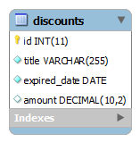

本教程您学习如何使用`LOAD DATA INFILE`语句将CSV文件导入到MySQL表中。
`LOAD DATA INFILE`语句允许您从文本文件读取数据，并将文件的数据快速导入数据库的表中。

在导入文件操作之前，需要准备以下内容：

- 将要导入文件的数据对应的数据库表。
- 准备好一个CSV文件，其数据与表的列数和每列中的数据类型相匹配。
- 连接到MySQL数据库服务器的帐户具有`FILE`和`INSERT`权限。

假设我们有一个名为`discounts`表，具有以下结构：



接下来，使用[CREATE TABLE](http://www.yiibai.com/mysql/create-table.html)语句创建`discounts`表，如下所示：

```sql
use testdb;
CREATE TABLE discounts (
    id INT NOT NULL AUTO_INCREMENT,
    title VARCHAR(255) NOT NULL,
    expired_date DATE NOT NULL,
    amount DECIMAL(10 , 2 ) NULL,
    PRIMARY KEY (id)
);
```

以下是`discounts.csv`文件的内容，第一行作为列标题和其他三行则为数据。

```sql
id,title,expired date,amout
1,"Spring Break 2018",20180401,20
2,"Back to Scholl 2017",20170901,29
3,"Summer 2018",20180820,100
```

以下语句将数据从`F:/worksp/mysql/discounts.csv`文件导入到`discounts`表。

```sql
LOAD DATA INFILE 'F:/worksp/mysql/discounts.csv' 
INTO TABLE discounts 
FIELDS TERMINATED BY ','
ENCLOSED BY '"'
LINES TERMINATED BY '\n'
IGNORE 1 ROWS;
```

文件的字段由`FIELD TERMINATED BY ','`指示的逗号终止，并由`ENCLOSED BY '"'`指定的双引号括起来。

因为文件第一行包含列标题，列标题不需要导入到表中，因此通过指定`IGNORE 1 ROWS`选项来忽略第一行。

现在，我们可以查看`discounts`表中的数据，查看是否成功导入了数据。

```sql
SELECT * FROM discounts;
```

执行上面查询语句，得到以下结果 -

```sql
mysql> SELECT * FROM discounts;
+----+---------------------+--------------+--------+
| id | title               | expired_date | amount |
+----+---------------------+--------------+--------+
|  1 | Spring Break 2018   | 2018-04-01   | 20     |
|  2 | Back to Scholl 2017 | 2017-09-01   | 29     |
|  3 | Summer 2018         | 2018-08-20   | 100    |
+----+---------------------+--------------+--------+
3 rows in set
```

**导入时转换数据**

有时，数据格式与表中的目标列不匹配。在简单的情况下，可以使用`LOAD DATA INFILE`语句中的`SET`子句进行转换。

假设有一个`discount_2.csv`文件中，它存储的过期日期列是`mm/dd/yyyy`格式。其内容如下所示 -

```sql
id,title,expired date,amout
4,"Item-4","01/04/2018",200
5,"Item-5","01/09/2017",290
6,"Item-6","12/08/2018",122
```

将数据导入`discounts`表时，必须使用[str_to_date()](http://www.yiibai.com/mysql/str_to_date.html)函数将其转换为MySQL日期格式，如下所示：

```sql
LOAD DATA INFILE 'F:/worksp/mysql/discounts_2.csv'
INTO TABLE discounts
FIELDS TERMINATED BY ',' ENCLOSED BY '"'
LINES TERMINATED BY '\n'
IGNORE 1 ROWS
(id,title,@expired_date,amount)
SET expired_date = STR_TO_DATE(@expired_date, '%m/%d/%Y');
```

现在查询表中的数据，得到以下结果 -

```sql
mysql> SELECT * FROM discounts;
+----+---------------------+--------------+--------+
| id | title               | expired_date | amount |
+----+---------------------+--------------+--------+
|  1 | Spring Break 2018   | 2018-04-01   | 20     |
|  2 | Back to Scholl 2017 | 2017-09-01   | 29     |
|  3 | Summer 2018         | 2018-08-20   | 100    |
|  4 | Item-4              | 2018-01-04   | 200    |
|  5 | Item-5              | 2017-01-09   | 290    |
|  6 | Item-6              | 2018-12-08   | 122    |
+----+---------------------+--------------+--------+
6 rows in set
```

**将文件从客户端导入远程MySQL数据库服务器**

可以使用`LOAD DATA INFILE`语句将数据从客户端(本地计算机)导入远程MySQL数据库服务器。

当您在`LOAD DATA INFILE`中使用`LOCAL`选项时，客户端程序会读取客户端上的文件并将其发送到MySQL服务器。该文件将被上传到数据库服务器操作系统的临时文件夹，例如Windows上的`C:\windows\temp`或Linux上为`/tmp`目录。 此文件夹不可由MySQL配置或确定。

我们来看看下面的例子：

```sql
LOAD DATA LOCAL INFILE  'c:/tmp/discounts.csv'
INTO TABLE discounts
FIELDS TERMINATED BY ',' 
ENCLOSED BY '"'
LINES TERMINATED BY '\n'
IGNORE 1 ROWS;
```

唯一的区别是语句中多了个`LOCAL`选项。如果加载一个大的CSV文件，将会看到使用`LOCAL`选项来加载该文件将会稍微慢些，因为需要时间将文件传输到数据库服务器。

使用`LOCAL`选项时，连接到MySQL服务器的帐户不需要具有`FILE`权限来导入文件。

使用`LOAD DATA LOCAL`将文件从客户端导入到远程数据库服务器时，有一些[安全问题](http://dev.mysql.com/doc/refman/5.7/en/load-data-local.html)应该要注意，以避免潜在的安全风险。