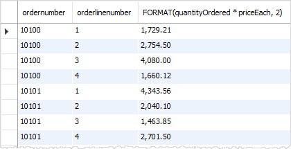
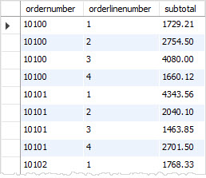

在本教程中，您将学习如何使用MySQL `ORDER BY`子句来排序结果集。

## 1. MySQL ORDER BY子句简介

当使用[SELECT语句](http://www.yiibai.com/mysql/select-statement-query-data.html)查询表中的数据时，结果集不按任何顺序进行排序。要对结果集进行排序，请使用`ORDER BY`子句。 `ORDER BY`子句允许：

- 对单个列或多个列排序结果集。
- 按升序或降序对不同列的结果集进行排序。

下面说明了`ORDER BY`子句的语法：

```sql
SELECT column1, column2,...
FROM tbl
ORDER BY column1 [ASC|DESC], column2 [ASC|DESC], ...
```

`ASC`表示升序，`DESC`表示降序。默认情况下，如果不明确指定`ASC`或`DESC`，`ORDER BY`子句会按照升序对结果集进行排序。

下面我们来学习和练习一些使用ORDER BY子句的例子。

## 2. MySQL ORDER BY示例

请参见[示例数据库(yiibaidb)](http://www.yiibai.com/mysql/sample-database.html)中的`customers`表，`customers`表的结构如下所示 -

```sql
mysql> desc customers;
+------------------------+---------------+------+-----+---------+-------+
| Field                  | Type          | Null | Key | Default | Extra |
+------------------------+---------------+------+-----+---------+-------+
| customerNumber         | int(11)       | NO   | PRI | NULL    |       |
| customerName           | varchar(50)   | NO   |     | NULL    |       |
| contactLastName        | varchar(50)   | NO   |     | NULL    |       |
| contactFirstName       | varchar(50)   | NO   |     | NULL    |       |
| phone                  | varchar(50)   | NO   |     | NULL    |       |
| addressLine1           | varchar(50)   | NO   |     | NULL    |       |
| addressLine2           | varchar(50)   | YES  |     | NULL    |       |
| city                   | varchar(50)   | NO   |     | NULL    |       |
| state                  | varchar(50)   | YES  |     | NULL    |       |
| postalCode             | varchar(15)   | YES  |     | NULL    |       |
| country                | varchar(50)   | NO   |     | NULL    |       |
| salesRepEmployeeNumber | int(11)       | YES  | MUL | NULL    |       |
| creditLimit            | decimal(10,2) | YES  |     | NULL    |       |
+------------------------+---------------+------+-----+---------+-------+
13 rows in set
```

以下查询从`customers`表中查询联系人，并按`contactLastname`升序对联系人进行排序。

```sql
SELECT
 contactLastname,
 contactFirstname
FROM
 customers
ORDER BY
 contactLastname;
```

执行上面查询，得到以下结果 -

```sql
mysql> SELECT
 contactLastname,
 contactFirstname
FROM
 customers
ORDER BY
 contactLastname;
+-----------------+------------------+
| contactLastname | contactFirstname |
+-----------------+------------------+
| Accorti         | Paolo            |
| Altagar,G M     | Raanan           |
| Andersen        | Mel              |
| Anton           | Carmen           |
| Ashworth        | Rachel           |
| Barajas         | Miguel           |
| Benitez         | Violeta          |
| Bennett         | Helen            |
| Berglund        | Christina        |
| Bergulfsen      | Jonas            |
| Bertrand        | Marie            |
... ....
| Young           | Julie            |
| Young           | Mary             |
| Young           | Dorothy          |
+-----------------+------------------+
122 rows in set
```

如果要按姓氏降序对联系人进行排序，请在`ORDER BY`子句中的`contactLastname`列后面指定`DESC`，如下查询：

```sql
SELECT
 contactLastname,
 contactFirstname
FROM
 customers
ORDER BY
 contactLastname DESC;
```

执行上面查询，得到以下结果 -

```sql
mysql> SELECT
 contactLastname,
 contactFirstname
FROM
 customers
ORDER BY
 contactLastname DESC;
+-----------------+------------------+
| contactLastname | contactFirstname |
+-----------------+------------------+
| Young           | Jeff             |
| Young           | Julie            |
| Young           | Mary             |
... ...
| Anton           | Carmen           |
| Andersen        | Mel              |
| Altagar,G M     | Raanan           |
| Accorti         | Paolo            |
+-----------------+------------------+
122 rows in set
```

如果要按姓氏按降序和名字按升序排序联系人，请在相应列中分别指定`DESC`和`ASC`，如下所示：

```sql
SELECT
 contactLastname,
 contactFirstname
FROM
 customers
ORDER BY
 contactLastname DESC,
 contactFirstname ASC;
```

执行上面查询，得到以下结果 -

```sql
mysql> SELECT
 contactLastname,
 contactFirstname
FROM
 customers
ORDER BY
 contactLastname DESC,
 contactFirstname ASC;
+-----------------+------------------+
| contactLastname | contactFirstname |
+-----------------+------------------+
| Young           | Dorothy          |
| Young           | Jeff             |
| Young           | Julie            |
| Young           | Mary             |
| Yoshido         | Juri             |
| Walker          | Brydey           |
| Victorino       | Wendy            |
| Urs             | Braun            |
| Tseng           | Jerry            |
... ...
| Brown           | Julie            |
| Brown           | William          |
| Bertrand        | Marie            |
| Bergulfsen      | Jonas            |
| Berglund        | Christina        |
| Bennett         | Helen            |
| Benitez         | Violeta          |
| Barajas         | Miguel           |
| Ashworth        | Rachel           |
| Anton           | Carmen           |
| Andersen        | Mel              |
| Altagar,G M     | Raanan           |
| Accorti         | Paolo            |
+-----------------+------------------+
122 rows in set
```

在上面的查询中，`ORDER BY`子句首先按照`contactLastname`列降序对结果集进行排序，然后按照`contactFirstname`列升序对排序结果集进行排序，以生成最终结果集。

**MySQL ORDER BY按表达式排序示例**

`ORDER BY`子句还允许您根据表达式对结果集进行排序。请参阅以下`orderdetails`表结构 -

```sql
mysql> desc orderdetails;
+-----------------+---------------+------+-----+---------+-------+
| Field           | Type          | Null | Key | Default | Extra |
+-----------------+---------------+------+-----+---------+-------+
| orderNumber     | int(11)       | NO   | PRI | NULL    |       |
| productCode     | varchar(15)   | NO   | PRI | NULL    |       |
| quantityOrdered | int(11)       | NO   |     | NULL    |       |
| priceEach       | decimal(10,2) | NO   |     | NULL    |       |
| orderLineNumber | smallint(6)   | NO   |     | NULL    |       |
+-----------------+---------------+------+-----+---------+-------+
5 rows in set
```

以下查询从`orderdetails`表中选择订单行记录项目。它计算每个订单项的小计，并根据订单编号，订单行号(`orderLineNumber`)和小计(`quantityOrdered * priceEach`)对结果集进行排序。

```sql
SELECT
 ordernumber,
 orderlinenumber,
 quantityOrdered * priceEach
FROM
 orderdetails
ORDER BY
 ordernumber,
 orderLineNumber,
 quantityOrdered * priceEach;
```

执行上面语句，总共有 `2996` 行结果集，以下是部分结果集片断 -



为了使查询更易于阅读，可以按列别名进行排序，方法如下：

```sql
SELECT
 ordernumber,
 orderlinenumber,
 quantityOrdered * priceEach AS subtotal
FROM
 orderdetails
ORDER BY
 ordernumber,
 orderLineNumber,
 subtotal;
```

执行上面语句，总共有 `2996` 行结果集，以下是部分结果集片断



上面表达式中，使用`subtotal`作为表达式`quantityOrdered * priceEach`的[列别名](http://www.yiibai.com/mysql/alias.html)，并根据小计别名(`subtotal`)对结果集进行排序。

## MySQL ORDER BY与自定义排序顺序

`ORDER BY`子句允许使用`FIELD()`函数为列中的值定义自己的自定义排序顺序。

看看下面 `orders`表的结构如下所示 -

```sql
mysql> desc orders;
+----------------+-------------+------+-----+---------+-------+
| Field          | Type        | Null | Key | Default | Extra |
+----------------+-------------+------+-----+---------+-------+
| orderNumber    | int(11)     | NO   | PRI | NULL    |       |
| orderDate      | date        | NO   |     | NULL    |       |
| requiredDate   | date        | NO   |     | NULL    |       |
| shippedDate    | date        | YES  |     | NULL    |       |
| status         | varchar(15) | NO   |     | NULL    |       |
| comments       | text        | YES  |     | NULL    |       |
| customerNumber | int(11)     | NO   | MUL | NULL    |       |
+----------------+-------------+------+-----+---------+-------+
7 rows in set
```

例如，如果要按以下顺序基于以下状态的值对订单进行排序：

- `In Process`
- `On Hold`
- `Cancelled`
- `Resolved`
- `Disputed`
- `Shipped`

可以使用`FIELD()`函数将这些值映射到数值列表，并使用数字进行排序; 请参阅以下查询：

```sql
SELECT 
    orderNumber, status
FROM
    orders
ORDER BY FIELD(status,
        'In Process',
        'On Hold',
        'Cancelled',
        'Resolved',
        'Disputed',
        'Shipped');
```

执行上面查询语句，得到以下结果 -

```sql
mysql> SELECT 
    orderNumber, status
FROM
    orders
ORDER BY FIELD(status,
        'In Process',
        'On Hold',
        'Cancelled',
        'Resolved',
        'Disputed',
        'Shipped');
+-------------+------------+
| orderNumber | status     |
+-------------+------------+
|       10420 | In Process |
|       10421 | In Process |
|       10422 | In Process |
|       10423 | In Process |
|       10424 | In Process |
|       10425 | In Process |
|       10334 | On Hold    |
|       10401 | On Hold    |
|       10407 | On Hold    |
|       10414 | On Hold    |
|       10167 | Cancelled  |
|       10179 | Cancelled  |
|       10248 | Cancelled  |
|       10253 | Cancelled  |
|       10260 | Cancelled  |
|       10262 | Cancelled  |
|       10164 | Resolved   |
|       10327 | Resolved   |
... ...
|       10413 | Shipped    |
|       10416 | Shipped    |
|       10418 | Shipped    |
|       10419 | Shipped    |
+-------------+------------+
326 rows in set
```

在本教程中，我们使用了各种示例演示了如何使用MySQL `ORDER BY`子句对结果集进行排序。