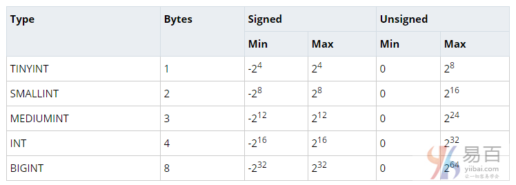

在本教程中，您将了解MySQL `INT`或整数数据类型以及如何在数据库表设计中使用它。 另外，我们将向您展示如何使用表中整数列的显示宽度和`ZEROFILL`属性。

## MySQL INT类型简介

在MySQL中，`INT`代表整数。整数可以写成没有分数的数值，例如，它可以是`1`，`100`，`4`，`-10`等，它不能是`1.2`，`5/3`等。整数可以是零，正和负。

MySQL支持所有标准SQL整数类型`INTEGER`、`INT`和`SMALLINT`。 此外，MySQL提供`TINYINT`， `MEDIUMINT`，`BIGINT`作为标准SQL的扩展。

MySQL `INT`数据类型可以是有符号或无符号。下表说明了每个整数类型的特性，包括以字节为单位的存储，最小值和最大值。



## 在列中使用INT

由于整数类型表示精确数字，因此通常将其用作表的[主键](http://www.yiibai.com/mysql/primary-key.html)。此外，`INT`列可以具有`AUTO_INCREMENT`属性。

当在`INT AUTO_INCREMENT`列中[插入](http://www.yiibai.com/mysql/insert-statement.html)`NULL`值或`0`时，列的值将设置为下一个[序列](http://www.yiibai.com/mysql/sequence.html)值。 请注意，序列值以`1`开始。

在`AUTO_INCREMENT`列中插入不为`NULL`或零的值时，列接受该值。 此外，序列将重置为插入值的下一个值。

我们来看一个使用带有`AUTO_INCREMENT`属性的整数列的表的例子。

首先，使用以下语句创建一个名为`items`的新表，其中整数列为主键：

```sql
USE testdb;

CREATE TABLE items (
    item_id INT AUTO_INCREMENT PRIMARY KEY,
    item_text VARCHAR(255)
);
```

可以在上面的[CREATE TABLE语句](http://www.yiibai.com/mysql/create-table.html)中使用`INT`或`INTEGER`，因为它们是可互换的。 每当在`items`表中插入一个新行时，`item_id`列的值将增加`1`。

接下来，以下[INSERT语句](http://www.yiibai.com/mysql/insert-statement.html)在`items`表中插入三行数据。

```sql
INSERT INTO items(item_text)
VALUES('laptop'), ('mouse'),('headphone');
```

然后，使用以下[SELECT语句](http://www.yiibai.com/mysql/select-statement-query-data.html)从`items`表查询数据：

```sql
SELECT 
    *
FROM
    items;
```

之后，插入一个新的行，该行的`item_id`列的值要明确指定。

```sql
INSERT INTO items(item_id,item_text)
VALUES(10,'Server');
```

因为`item_id`列的当前值为`10`，所以序列将重置为`11`。如果插入新行，则`AUTO_INCREMENT`列将使用`11`作为下一个值。

```sql
INSERT INTO items(item_text)
VALUES('Router');
```

最后，再次查询`items`表中的数据，如下结果。

```sql
SELECT 
    *
FROM
    items;
```

> 请注意，由于自*MySQL 5.1*版本起，`AUTO_INCREMENT`列只接受正值。`AUTO_INCREMENT`列不支持负数值。

## MySQL INT和显示宽度属性

MySQL提供了一个扩展，允许您指定显示宽度以及`INT`数据类型。显示宽度包含在`INT`关键字后面的括号内，例如，`INT(5)`指定一个显示宽度为五位数的`INT`。

要注意的是，显示宽度属性不能控制列可以存储的值范围。显示宽度属性通常由应用程序用于格式化整数值。 MySQL将显示宽度属性作为返回结果集的元数据。

## 具有ZEROFILL属性的MySQL INT

除了显示宽度之外，MySQL还提供了非标准的`ZEROFILL`属性。 在这种情况下，MySQL将空格替换为零。请参考以下示例。

首先，使用以下语句创建一个名为`zerofill_tests`的表：

```sql
USE testdb;

CREATE TABLE zerofill_tests(
    id INT AUTO_INCREMENT PRIMARY KEY,
    v1 INT(2) ZEROFILL,
    v2 INT(3) ZEROFILL,
    v3 INT(5) ZEROFILL
);
```

其次，在`zerofill_tests`表中插入一个新行。

```sql
INSERT into zerofill_tests(v1,v2,v3)
VALUES(1,6,9);
```

第三，从`zerofill_tests`表[查询数据](http://www.yiibai.com/mysql/select-statement-query-data.html)。

```sql
SELECT 
    v1, v2, v3
FROM
    zerofill_tests;
```

`v1`列的显示宽度为`2`，包括`ZEROFILL`，它的值为`1`，因此在输出中看到`01`。 MySQL将第一个空格替换为`0`。

`v2`列具有包含`ZEROFILL`的显示宽度`3`。 它的值为`6`，因此将看到有`00`作为前导零。

`v3`列具有包含`ZEROFILL`的显示宽度`5`，它的值为`9`，因此MySQL在输出数字的开头填零为`0000`。

> 请注意，如果对整数列使用`ZEROFILL`属性，MySQL将自动将一个`UNSIGNED`属性添加到该列。

在本教程中，我们向您展示了如何在表中使用MySQL `INT`数据类型，并向您介绍了整数列的显示宽度和`ZEROFILL`属性。