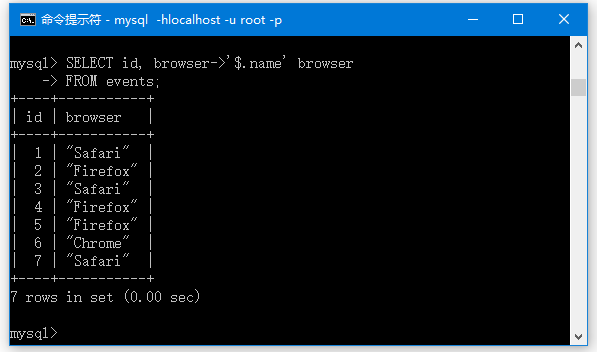

在本教程中，您将学习如何使用MySQL `JSON`数据类型将`JSON`文档存储在数据库中。

## MySQL JSON数据类型简介

自*MySQL5.7.8*版本以来，MySQL支持原生JSON数据类型。允许使用原生JSON数据类型比以前MySQL版本中所使用JSON文本格式更能有效地存储JSON文档。

MySQL以内部格式存储JSON文档，允许对文档元素的快速读取访问。JSON二进制格式的结构是允许服务器通过键或数组索引直接搜索JSON文档中的值，这非常快。

JSON文档的存储大约与存储`LONGBLOB`或`LONGTEXT`数据量相同。

要定义数据类型为JSON的列，请使用以下语法：

```sql
CREATE TABLE table_name (
    ...
    json_column_name JSON,
    ... 
);
```

> 请注意，JSON列不能有默认值。 此外，JSON列不能直接编入[索引](http://www.yiibai.com/mysql/create-drop-index.html)。可以在包含从JSON列中提取的值的[生成列](http://www.yiibai.com/mysql/generated-columns.html)上创建索引。当从JSON列[查询数据](http://www.yiibai.com/mysql/select-statement-query-data.html)时，MySQL优化器将在匹配JSON表达式的虚拟列上查找兼容的索引。

## MySQL JSON数据类型示例

假设跟踪访客在网站上的行为。 一些访问者可能只是查看页面，而其他访问者可能会查看页面并购买产品。 要存储这些信息，我们将[创建](http://www.yiibai.com/mysql/create-table.html)一个名为`events`的新表。

```sql
USE testdb;
CREATE TABLE events( 
  id int auto_increment primary key, 
  event_name varchar(255), 
  visitor varchar(255), 
  properties json, 
  browser json
);
```

事件表中的每个事件都有一个唯一标识事件的`id`。事件还有一个`event_name`列，例如浏览量，购买等。`visitor`列用于存储访问者信息。

`properties`和`browser`列是JSON类型。 它们用于存储访问者浏览网站的事件属性和浏览器信息(如版本，名称等等)。

我们将一些数据[插入](http://www.yiibai.com/mysql/insert-statement.html)到`events`表中：

```sql
INSERT INTO events(event_name, visitor,properties, browser) 
VALUES (
  'pageview', 
   '1',
   '{ "page": "/" }',
   '{ "name": "Safari", "os": "Mac", "resolution": { "x": 1920, "y": 1080 } }'
),
('pageview', 
  '2',
  '{ "page": "/contact" }',
  '{ "name": "Firefox", "os": "Windows", "resolution": { "x": 2560, "y": 1600 } }'
),
(
  'pageview', 
  '1',
  '{ "page": "/products" }',
  '{ "name": "Safari", "os": "Mac", "resolution": { "x": 1920, "y": 1080 } }'
),
(
  'purchase', 
   '3',
  '{ "amount": 200 }',
  '{ "name": "Firefox", "os": "Windows", "resolution": { "x": 1600, "y": 900 } }'
),
(
  'purchase', 
   '4',
  '{ "amount": 150 }',
  '{ "name": "Firefox", "os": "Windows", "resolution": { "x": 1280, "y": 800 } }'
),
(
  'purchase', 
  '4',
  '{ "amount": 500 }',
  '{ "name": "Chrome", "os": "Windows", "resolution": { "x": 1680, "y": 1050 } }'
);
```

要从JSON列中引出值，可以使用列路径运算符(`->`)。

```sql
SELECT id, browser->'$.name' browser FROM events;
```

此查询返回以下输出：



请注意，上面查询语句要在命令中连接到MySQL服务器(`mysql -hlocalhost -uroot -p`)。可以看到`browser`列中的数据被引号包围。要删除引号，请使用内联路径运算符( `->>`)，如下所示：

```sql
SELECT id, browser->>'$.name' browser
FROM events;
```

从以下输出可以看出，引号已被删除：

```sql
+----+---------+
| id | browser |
+----+---------+
|  1 | Safari  |
|  2 | Firefox |
|  3 | Safari  |
|  4 | Firefox |
|  5 | Firefox |
|  6 | Chrome  |
+----+---------+
6 rows in set (0.00 sec)
```

要获取浏览器的使用情况，可以使用以下语句：

```sql
SELECT browser->>'$.name' browser, 
      count(browser)
FROM events
GROUP BY browser->>'$.name';
```

上面查询语句的输出如下：

```sql
+---------+----------------+
| browser | count(browser) |
+---------+----------------+
| Safari  |              2 |
| Firefox |              3 |
| Chrome  |              1 |
+---------+----------------+
3 rows in set (0.02 sec)
```

要计算访问者的总购买量，请使用以下查询：

```sql
SELECT visitor, SUM(properties->>'$.amount') revenue
FROM events
WHERE properties->>'$.amount' > 0
GROUP BY visitor;
```

上面查询语句的输出如下：

```sql
+---------+---------+
| visitor | revenue |
+---------+---------+
| 3       |     200 |
| 4       |     650 |
+---------+---------+
2 rows in set (0.00 sec)
```

在本教程中，您已经了解了MySQL `JSON`数据类型以及如何使用它来存储数据库中的`JSON`文档。