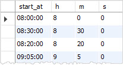

在本教程中，我们将向您介绍MySQL `TIME`数据类型，并显示有用的时间函数来有效地处理时间数据。

## MySQL TIME数据类型简介

MySQL使用`HH:MM:SS`格式来查询和显示代表一天中的时间值(在`24`小时内)。要表示两个事件之间的时间[间隔](http://www.yiibai.com/mysql/interval.html)，MySQL使用大于`24`小时的`HHH:MM:SS`格式。

要定义`TIME`数据类型的列，请使用以下语法：

```sql
column_name TIME;
```

例如，以下代码片段定义了一个名为`start_at`的列，其中包含`TIME`数据类型。

```sql
start_at TIME;
```

`TIME`值范围为`-838:59:59`至`838:59:59`。 此外，`TIME`值可以具有高达微秒精度(`6`位数)的小数秒部分。 要使用小数秒精度部分定义数据类型为`TIME`的列，请使用以下语法：

```sql
column_name TIME(N);
```

*N*是表示小数部分的[整数值](http://www.yiibai.com/mysql/int.html)，最多`6`位数。

以下代码片段定义了`TIME`数据类型的列，其中包含`3`位数的小数秒。

```sql
begin_at TIME(3);
```

`TIME`值需要`3`个字节进行存储。如果`TIME`值包括分数秒精度，则会根据小数秒精度的位数获取额外的字节。下表说明了小数秒精度所需的存储空间。

| 分数秒精度 | 存储(字节) |
| ---------- | ---------- |
| 0          | 0          |
| 1，2       | 1          |
| 3，4       | 2          |
| 5，6       | 3          |

例如，`TIME`和`TIME(0)`需要`3`个字节。 `TIME(1)`和`TIME(2)`需要`4`个字节(`3 + 1`); `TIME(3)`和`TIME(6)`分别需要`5`和`6`个字节。

## MySQL TIME数据类型示例

让我们来看一下在表中对列使用`TIME`数据类型的例子。

**首先**，创建一个名为`tests`的新表，其中包含四个列：`id`，`name`，`start_at`和`end_at`。 `start_at`和`end_at`列的数据类型为`TIME`。

```sql
USE testdb;

CREATE TABLE tests (
    id INT PRIMARY KEY AUTO_INCREMENT,
    name VARCHAR(255) NOT NULL,
    start_at TIME,
    end_at TIME
);
```

**第二步**，在`tests`表中[插入](http://www.yiibai.com/mysql/insert-statement.html)一行。

```sql
INSERT INTO tests(name,start_at,end_at)
VALUES('Test 1', '08:00:00','10:00:00');
```

**第三步**，从`tests`表[查询数据](http://www.yiibai.com/mysql/select-statement-query-data.html)，如下语句：

```sql
SELECT 
    name, start_at, end_at
FROM
    tests;
```

执行上面查询语句，得到以下结果 -

```

```

请注意，我们使用“`HH:MM:SS`”作为[INSERT](http://www.yiibai.com/mysql/insert-statement.html)语句中的文字时间值。下面来看看MySQL可以识别的所有有效的时间文字。

## MySQL TIME文字

除了我们之前提到的“`HH:MM:SS`”格式之外，MySQL还可以识别各种时间格式。

MySQL允许使用“`HHMMSS`”格式，而不使用分隔符(`:`)表示时间值。 例如’`08:30:00`‘和’`10:15:00`‘可以重写为’`083000`‘和’`101500`‘。

```sql
INSERT INTO tests(name,start_at,end_at)
VALUES('Test 2','083000','101500');
```

但是，`108000`不是有效的时间值，因为`80`不代表正确的分钟。 在这种情况下，如果您尝试在表中插入无效的时间值，MySQL会引发错误。

```sql
INSERT INTO tests(name,start_at,end_at)
VALUES('Test invalid','083000','108000');
```

执行上述语句后，MySQL发出以下错误消息。

```sql
Error Code: 1292. Incorrect time value: '108000' for column 'end_at' at row 1
```

除了字符串格式之外，MySQL接受`HHMMSS`作为代表时间值的数字。也可以使用`SS`，`MMSS`。 例如，可以使用`082000`，而不是使用`'082000'`，如下所示：

```sql
INSERT INTO tests(name,start_at,end_at)
VALUES('Test 3',082000,102000);
```

对于时间间隔，您可以使用`'D HH:MM:SS'`格式，其中`D`代表天数从`0`到`34`的范围。更灵活的语法是`'HH:MM'`，`'D HH:MM'`，`'D HH'`或`'SS'`。

如果使用分隔符`:`，可以使用`1`位数字表示小时，分钟或秒。 例如，可以使用`9:5:0`而不是`'09:05:00'`。

```sql
INSERT INTO tests(name,start_at,end_at)
VALUES('Test 4','9:5:0',100500);
```

## MySQL TIME函数

MySQL提供了几个有用的时间函数来处理`TIME`数据。

**获取当前时间**

要获取数据库服务器的当前时间，请使用`CURRENT_TIME`函数。根据使用该函数的上下文，`CURRENT_TIME`函数以字符串(`'HH:MM:SS'`)或数值(`HHMMSS`)返回当前时间值。

以下语句说明了字符串和数字上下文中的`CURRENT_TIME`函数：

```sql
SELECT 
    CURRENT_TIME() AS string_now,
    CURRENT_TIME() + 0 AS numeric_now;
```

执行上面查询语句，得到以下结果 -

```sql
+------------+-------------+
| string_now | numeric_now |
+------------+-------------+
| 23:04:53   |      230453 |
+------------+-------------+
1 row in set
```

**从TIME值添加和减去时间**

要将`TIME`值添加到另一个`TIME`值，请使用`ADDTIME`函数。要从另一个`TIME`值中减去`TIME`值，可以使用`SUBTIME`函数。

以下语句从当前时间起减去`2`小时`30`分钟。

```sql
SELECT 
    CURRENT_TIME(),
    ADDTIME(CURRENT_TIME(), 023000), 
    SUBTIME(CURRENT_TIME(), 023000);
```

执行上面查询语句，得到以下结果 -

```sql
+----------------+---------------------------------+---------------------------------+
| CURRENT_TIME() | ADDTIME(CURRENT_TIME(), 023000) | SUBTIME(CURRENT_TIME(), 023000) |
+----------------+---------------------------------+---------------------------------+
| 23:05:03       | 25:35:03                        | 20:35:03                        |
+----------------+---------------------------------+---------------------------------+
1 row in set
```

此外，可以使用`TIMEDIFF()`函数来获取两个`TIME`值之间的差异。

```sql
SELECT 
    TIMEDIFF(end_at, start_at)
FROM
    tests;
```

执行上面查询语句，得到以下结果 -

```sql
mysql> SELECT 
    TIMEDIFF(end_at, start_at)
FROM
    tests;
+----------------------------+
| TIMEDIFF(end_at, start_at) |
+----------------------------+
| 02:00:00                   |
| 01:45:00                   |
| 02:00:00                   |
| 01:00:00                   |
+----------------------------+
4 rows in set
```

**格式化MySQL TIME值**

虽然MySQL在检索和显示`TIME`值时使用“`HH:MM:SS`”，但可以使用`TIME_FORMAT`函数以推荐的方式显示`TIME`值。

`TIME_FORMAT`函数类似于[DATE_FORMAT](http://www.yiibai.com/mysql/date_format.html)函数，除了`TIME_FORMAT`函数仅用于格式化`TIME`值其它均差不多。

请参见以下一个示例 -

```sql
SELECT 
    name,
    TIME_FORMAT(start_at, '%h:%i %p') start_at,
    TIME_FORMAT(end_at, '%h:%i %p') end_at
FROM
    tests;
```

执行上面查询语句，得到以下结果 -

```sql
+--------+----------+----------+
| name   | start_at | end_at   |
+--------+----------+----------+
| Test 1 | 08:00 AM | 10:00 AM |
| Test 2 | 08:30 AM | 10:15 AM |
| Test 3 | 08:20 AM | 10:20 AM |
| Test 4 | 09:05 AM | 10:05 AM |
+--------+----------+----------+
4 rows in set
```

在上面的时间格式字符串中：

- `％h`表示从`0`到`12`的两位数小时数值。
- `％i`表示从`0`到`60`的两位数分钟数值。
- `％p`表示`AM`或`PM`，也就是表示上午或下午。

**从TIME值提取小时，分钟和秒**

要从`TIME`值中提取小时，分和秒，可以使用`HOUR`，`MINUTE`和`SECOND`函数，如下所示：



**获取UTC时间值**

要获取`UTC`时间，请使用`UTC_TIME`函数，如下所示：

```sql
SELECT 
   CURRENT_TIME(), 
   UTC_TIME();
```

执行上面查询语句，得到以下结果 -

```sql
+----------------+------------+
| CURRENT_TIME() | UTC_TIME() |
+----------------+------------+
| 23:05:41       | 15:05:41   |
+----------------+------------+
1 row in set
```

在本教程中，我们已经介绍了有关MySQL `TIME`数据类型和一些常用的时间函数来处理`TIME`值。