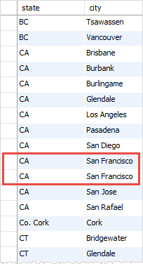

## MySQL DISTINCT 子句简介

从表中查询数据时，可能会收到重复的行记录。为了删除这些重复行，可以在`SELECT`语句中使用`DISTINCT`子句。

`DISTINCT`子句的语法如下：

```sql
SELECT DISTINCT
    columns
FROM
    table_name
WHERE
    where_conditions;
```

## MySQL DISTINCT 示例

下面来看看一个使用`DISTINCT`子句从`employees`表中选择员工的唯一姓氏(`lastName`)的简单示例。

首先，使用`SELECT`语句从`employees`表中查询员工的姓氏(`lastName`)，如下所示：

```sql
SELECT 
    lastname
FROM
    employees
ORDER BY lastname;
```

执行上面查询语句，得到以下结果

```sql
mysql> SELECT lastname FROM employees ORDER BY lastname;
+-----------+
| lastname  |
+-----------+
| Bondur    |
| Bondur    |
| Bott      |
| Bow       |
| Castillo  |
| Firrelli  |
| Firrelli  |
| Fixter    |
| Gerard    |
| Hernandez |
| Jennings  |
| Jones     |
| Kato      |
| King      |
| Marsh     |
| Murphy    |
| Nishi     |
| Patterson |
| Patterson |
| Patterson |
| Thompson  |
| Tseng     |
| Vanauf    |
+-----------+
23 rows in set
```

可看到上面结果中，有好些结果是重复的，比如：`Bondur`，`Firrelli`等，那如何做到相同的结果只显示一个呢？要删除重复的姓氏，请将`DISTINCT`子句添加到`SELECT`语句中，如下所示：

```sql
SELECT DISTINCT
    lastname
FROM
    employees
ORDER BY lastname;
```

执行上面查询，得到以下输出结果

```sql
mysql> SELECT DISTINCT lastname FROM employees ORDER BY lastname;
+-----------+
| lastname  |
+-----------+
| Bondur    |
| Bott      |
| Bow       |
| Castillo  |
| Firrelli  |
| Fixter    |
| Gerard    |
| Hernandez |
| Jennings  |
| Jones     |
| Kato      |
| King      |
| Marsh     |
| Murphy    |
| Nishi     |
| Patterson |
| Thompson  |
| Tseng     |
| Vanauf    |
+-----------+
19 rows in set
```

当使用`DISTINCT`子句时，重复的姓氏(`lastname`)在结果集中被消除。

## MySQL DISTINCT和NULL值

如果列具有`NULL`值，并且对该列使用`DISTINCT`子句，MySQL将保留一个`NULL`值，并删除其它的`NULL`值，因为`DISTINCT`子句将所有`NULL`值视为相同的值。

例如，在`customers`表中，有很多行的州(`state`)列是`NULL`值。 当使用`DISTINCT`子句来查询客户所在的州时，我们将看到唯一的州和`NULL`值，如下查询所示：

```sql
SELECT DISTINCT
    state
FROM
    customers;
```

执行上面查询语句后，输出结果如下 -

```sql
mysql> SELECT DISTINCT state FROM customers;
+---------------+
| state         |
+---------------+
| NULL          |
| NV            |
| Victoria      |
| CA            |
| NY            |
| PA            |
| CT            |
| MA            |
| Osaka         |
| BC            |
| Qubec         |
| Isle of Wight |
| NSW           |
| NJ            |
| Queensland    |
| Co. Cork      |
| Pretoria      |
| NH            |
| Tokyo         |
+---------------+
19 rows in set
```

## MySQL DISTINCT 在多列上的使用

可以使用具有多个列的`DISTINCT`子句。 在这种情况下，MySQL 使用所有列的组合来确定结果集中行的唯一性。

例如，要从`customers`表中获取城市(`city`)和州(`state`)的唯一组合，可以使用以下查询：

```sql
SELECT DISTINCT
    state, city
FROM
    customers
WHERE
    state IS NOT NULL
ORDER BY state , city;
```

执行上面查询，得到以下结果 -

```sql
mysql> SELECT DISTINCT state, city FROM  customers WHERE state IS NOT NULL ORDER BY state ,city;
+---------------+----------------+
| state         | city           |
+---------------+----------------+
| BC            | Tsawassen      |
| BC            | Vancouver      |
| CA            | Brisbane       |
| CA            | Burbank        |
| CA            | Burlingame     |
| CA            | Glendale       |
| CA            | Los Angeles    |
| CA            | Pasadena       |
| CA            | San Diego      |
| CA            | San Francisco  |
| CA            | San Jose       |
| CA            | San Rafael     |
| Co. Cork      | Cork           |
| CT            | Bridgewater    |
| CT            | Glendale       |
| CT            | New Haven      |
| Isle of Wight | Cowes          |
| MA            | Boston         |
| MA            | Brickhaven     |
| MA            | Cambridge      |
| MA            | New Bedford    |
| NH            | Nashua         |
| NJ            | Newark         |
| NSW           | Chatswood      |
| NSW           | North Sydney   |
| NV            | Las Vegas      |
| NY            | NYC            |
| NY            | White Plains   |
| Osaka         | Kita-ku        |
| PA            | Allentown      |
| PA            | Philadelphia   |
| Pretoria      | Hatfield       |
| Qubec         | Montral        |
| Queensland    | South Brisbane |
| Tokyo         | Minato-ku      |
| Victoria      | Glen Waverly   |
| Victoria      | Melbourne      |
+---------------+----------------+
37 rows in set
```

没有`DISTINCT`子句，将查询获得州(`state`)和城市(`city`)的重复组合如下：

```sql
SELECT 
    state, city
FROM
    customers
WHERE
    state IS NOT NULL
ORDER BY state, city;
```

执行上面查询，得到以下结果 -



## DISTINCT 子句与 GROUP BY 子句比较

如果在`SELECT`语句中使用`GROUP BY`子句，而不使用聚合函数，则`GROUP BY`子句的行为与`DISTINCT`子句类似。

以下语句使用`GROUP BY`子句来选择`customers`表中客户的唯一`state`列的值。

```sql
SELECT 
    state
FROM
    customers
GROUP BY state;
```

执行上面查询，得到以下结果 -

```sql
mysql> SELECT  state FROM customers GROUP BY state;
+---------------+
| state         |
+---------------+
| NULL          |
| BC            |
| CA            |
| Co. Cork      |
| CT            |
| Isle of Wight |
| MA            |
| NH            |
| NJ            |
| NSW           |
| NV            |
| NY            |
| Osaka         |
| PA            |
| Pretoria      |
| Qubec         |
| Queensland    |
| Tokyo         |
| Victoria      |
+---------------+
19 rows in set
```

可以通过使用`DISTINCT`子句来实现类似的结果：

```sql
mysql> SELECT DISTINCT state FROM customers;
+---------------+
| state         |
+---------------+
| NULL          |
| NV            |
| Victoria      |
| CA            |
| NY            |
| PA            |
| CT            |
| MA            |
| Osaka         |
| BC            |
| Qubec         |
| Isle of Wight |
| NSW           |
| NJ            |
| Queensland    |
| Co. Cork      |
| Pretoria      |
| NH            |
| Tokyo         |
+---------------+
19 rows in set
```

一般而言，`DISTINCT`子句是`GROUP BY`子句的特殊情况。 `DISTINCT`子句和`GROUP BY`子句之间的区别是`GROUP BY`子句可对[结果集进行排序](http://www.yiibai.com/mysql/order-by.html)，而`DISTINCT`子句不进行排序。

如果将[ORDER BY子句](http://www.yiibai.com/mysql/order-by.html)添加到使用`DISTINCT`子句的语句中，则结果集将被排序，并且与使用`GROUP BY`子句的语句返回的结果集相同。

```sql
SELECT DISTINCT
    state
FROM
    customers
ORDER BY state;
```

执行上面查询，得到以下结果 -

```sql
mysql> SELECT DISTINCT state FROM customers ORDER BY state;
+---------------+
| state         |
+---------------+
| NULL          |
| BC            |
| CA            |
| Co. Cork      |
| CT            |
| Isle of Wight |
| MA            |
| NH            |
| NJ            |
| NSW           |
| NV            |
| NY            |
| Osaka         |
| PA            |
| Pretoria      |
| Qubec         |
| Queensland    |
| Tokyo         |
| Victoria      |
+---------------+
19 rows in set
```

## MySQL DISTINCT 和聚合函数

可以使用具有[聚合函数](http://www.yiibai.com/mysql/aggregate-functions.html)(例如[SUM](http://www.yiibai.com/mysql/sum.html)，[AVG](http://www.yiibai.com/mysql/avg.html)和[COUNT](http://www.yiibai.com/mysql/count.html))的`DISTINCT`子句中，在MySQL将聚合函数应用于结果集之前删除重复的行。

例如，要计算美国客户的唯一`state`列的值，可以使用以下查询：

```sql
SELECT 
    COUNT(DISTINCT state)
FROM
    customers
WHERE
    country = 'USA';
```

执行上面查询，得到以下结果 -

```sql
mysql> SELECT  COUNT(DISTINCT state) FROM customers WHERE country = 'USA';
+-----------------------+
| COUNT(DISTINCT state) |
+-----------------------+
|                     8 |
+-----------------------+
1 row in set
```

## MySQL DISTINCT与LIMIT子句

如果要将`DISTINCT`子句与 [LIMIT 子句](http://www.yiibai.com/mysql/limit.html) 一起使用，MySQL 会在查找`LIMIT`子句中指定的唯一行数时立即停止搜索。

以下查询`customers`表中的前`3`个非空(NOT NULL)唯一`state`列的值。

```sql
mysql> SELECT DISTINCT state FROM customers WHERE state IS NOT NULL LIMIT 3;
+----------+
| state    |
+----------+
| NV       |
| Victoria |
| CA       |
+----------+
3 rows in set
```

在本教程中，我们学习了使用  MySQL  `DISTINCT`子句的各种方法，例如消除重复行和计数非`NULL`值。