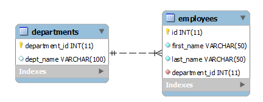

在本教程中，您将学习如何使用MySQL `RENAME TABLE`语句和`ALTER TABLE`语句重命名表。

## MySQL RENAME TABLE语句简介

由于业务需求变化，我们需要将当前表重新命名为新表，以更好地反映或表示新情况。 MySQL提供了一个非常有用的语句来更改一个或多个表的名称。

要更改一个或多个表，我们使用`RENAME TABLE`语句如下：

```sql
RENAME TABLE old_table_name TO new_table_name;
```

旧表(`old_table_name`)必须存在，新表(`new_table_name`)必须不存在。 如果新表`new_table_name`存在，则该语句将失败。

除了表之外，我们还可以使用`RENAME TABLE`语句来重命名[视图](http://www.yiibai.com/mysql/views.html)。

在执行`RENAME TABLE`语句之前，必须确保没有活动事务或[锁定表](http://www.yiibai.com/mysql/table-locking.html)。

> 请注意，不能使用`RENAME TABLE`语句来重命名[临时表](http://www.yiibai.com/mysql/temporary-table.html)，但可以使用[ALTER TABLE语句](http://www.yiibai.com/mysql/alter-table.html)重命名临时表。

在安全性方面，我们[授予旧表](http://www.yiibai.com/mysql/grant.html)的任何权限必须手动迁移到新表。

在重命名表之前，应该彻底地评估影响。 例如，应该调查哪些应用程序正在使用该表。 如果表的名称更改，那么引用表名的应用程序代码也需要更改。 此外，您必须手动调整引用该表的其他数据库对象，如[视图](http://www.yiibai.com/mysql/views.html)，[存储过程](http://www.yiibai.com/mysql/stored-procedure.html)，[触发器](http://www.yiibai.com/mysql/triggers.html)，[外键约束](http://www.yiibai.com/mysql/foreign-key.html)等。 我们将在下面的例子中更详细地讨论。

## MySQL RENAME TABLE示例

**首先**，我们创建一个名为`hrdb`的新数据库，它由两个表组成：`employees` 和 `departments`。



创建数据库 -

```sql
CREATE DATABASE IF NOT EXISTS hrdb;
```

创建表 -

```sql
USE hrdb;

CREATE TABLE departments (
    department_id INT AUTO_INCREMENT PRIMARY KEY,
    dept_name VARCHAR(100)
);

CREATE TABLE employees (
    id int AUTO_INCREMENT primary key,
    first_name varchar(50) not null,
    last_name varchar(50) not null,
    department_id int not null,
    FOREIGN KEY (department_id)
        REFERENCES departments (department_id)
);
```

**其次**，将样本数据插入到 `employees` 和 `departments` 表中：

```sql
-- 插入数据到 departments 表中
INSERT INTO departments(dept_name)
VALUES('Sales'),('Markting'),('Finance'),('Accounting'),('Warehouses'),('Production');

-- 插入数据到 employees 表中
INSERT INTO employees(first_name,last_name,department_id) 
VALUES('John','Doe',1),
 ('Bush','Lily',2),
 ('David','Dave',3),
 ('Mary','Jane',4),
 ('Jonatha','Josh',5),
 ('Mateo','More',1);
```

**第三**，查询在 `employees` 和 `departments` 表中的数据：

```sql
mysql> SELECT 
    department_id, dept_name
FROM
    departments;
+---------------+------------+
| department_id | dept_name  |
+---------------+------------+
|             1 | Sales      |
|             2 | Markting   |
|             3 | Finance    |
|             4 | Accounting |
|             5 | Warehouses |
|             6 | Production |
+---------------+------------+
6 rows in set

mysql> SELECT 
    id, first_name, last_name, department_id
FROM
    employees;
+----+------------+-----------+---------------+
| id | first_name | last_name | department_id |
+----+------------+-----------+---------------+
|  1 | John       | Doe       |             1 |
|  2 | Bush       | Lily      |             2 |
|  3 | David      | Dave      |             3 |
|  4 | Mary       | Jane      |             4 |
|  5 | Jonatha    | Josh      |             5 |
|  6 | Mateo      | More      |             1 |
+----+------------+-----------+---------------+
6 rows in set
```

**重命名视图引用的表**

如果重命名一个被[视图](http://www.yiibai.com/mysql/views.html)引用的表，在重命名表后，视图就无效了，并且必须手动调整视图。

例如，我们基于`employees`和`departments`表创建一个名为`v_employee_info`的视图，如下所示：

```sql
CREATE VIEW v_employee_info as
    SELECT 
        id, first_name, last_name, dept_name
    from
        employees
            inner join
        departments USING (department_id);
```

视图使用[内连接](http://www.yiibai.com/mysql/inner-join.html)子句来连接`employees`和`departments`表。

以下[SELECT语句](http://www.yiibai.com/mysql/select-statement-query-data.html)返回`v_employee_info`视图中的所有数据。

```sql
mysql> SELECT 
    *
FROM
    v_employee_info;
+----+------------+-----------+------------+
| id | first_name | last_name | dept_name  |
+----+------------+-----------+------------+
|  1 | John       | Doe       | Sales      |
|  2 | Bush       | Lily      | Markting   |
|  3 | David      | Dave      | Finance    |
|  4 | Mary       | Jane      | Accounting |
|  5 | Jonatha    | Josh      | Warehouses |
|  6 | Mateo      | More      | Sales      |
+----+------------+-----------+------------+
6 rows in set
```

现在，将`v_employee_info`视图中的`employees`表重命名为`people`，并查询视图的数据。

```sql
RENAME TABLE employees TO people;

-- 查询数据
SELECT 
    *
FROM
    v_employee_info;
```

MySQL返回以下错误消息：

```sql
1356 - View 'hrdb.v_employee_info' references invalid table(s) or column(s) or function(s) or definer/invoker of view lack rights to use them
```

我们可以使用`CHECK TABLE`语句来检查`v_employee_info`视图的状态如下：

```sql
CHECK TABLE v_employee_info;
mysql> CHECK TABLE v_employee_info;
+----------------------+-------+----------+----------------------------------------------------------------------------------------------------------------------------------------+
| Table                | Op    | Msg_type | Msg_text                                                                                                                               |
+----------------------+-------+----------+----------------------------------------------------------------------------------------------------------------------------------------+
| hrdb.v_employee_info | check | Error    | Table 'hrdb.employees' doesn't exist                                                                                                   |
| hrdb.v_employee_info | check | Error    | View 'hrdb.v_employee_info' references invalid table(s) or column(s) or function(s) or definer/invoker of view lack rights to use them |
| hrdb.v_employee_info | check | error    | Corrupt                                                                                                                                |
+----------------------+-------+----------+----------------------------------------------------------------------------------------------------------------------------------------+
3 rows in set
```

需要手动更改`v_employee_info`视图，以便它引用`people`表而不是`employees`表。

**重命名由存储过程引用的表**

如果要重命名由[存储过程](http://www.yiibai.com/mysql/stored-procedure-tutorial.html)引用的表，则必须像对视图一样进行手动调整。

首先，将`people`表重命名为`employees`表。

```sql
RENAME TABLE people TO employees;
```

然后，创建一个名为`get_employee`的新存储过程，该过程引用`employees`表。

```sql
DELIMITER $$

CREATE PROCEDURE get_employee(IN p_id INT)

BEGIN
 SELECT first_name
 ,last_name
 ,dept_name
 FROM employees
 INNER JOIN departments using (department_id)
 WHERE id = p_id;
END $$

DELIMITER;
```

接下来，执行`get_employee`存储过程从`employees`表来获取`id`为`1`的员工的数据，如下所示：

```sql
CALL get_employee(1);
```

执行上面查询语句，得到以下结果 -

```sql
mysql> CALL get_employee(1);
+------------+-----------+-----------+
| first_name | last_name | dept_name |
+------------+-----------+-----------+
| John       | Doe       | Sales     |
+------------+-----------+-----------+
1 row in set

Query OK, 0 rows affected
```

之后，我们再次将`employees`表重新命名为`people`表。

```sql
RENAME TABLE employees TO people;
```

最后，调用`get_employee`存储过程来获取`id`为`2`的员工信息：

```sql
CALL get_employee(2);
```

MySQL返回以下错误消息：

```sql
1146 - Table 'hrdb.employees' doesn't exist
```

要解决这个问题，我们必须手动将存储过程中的`employees`表更改为`people`表。

**重命名引用外键的表**

`departments`表使用`department_id`列链接到`employees`表。 `employees`表中的`department_id`列是引用`departments`表的`department_id`列作为[外键](http://www.yiibai.com/mysql/foreign-key.html)。

如果重命名`departments`表，那么指向`departments`表的所有外键都不会被自动更新。 在这种情况下，我们必须手动删除并重新创建外键。

```sql
RENAME TABLE departments TO depts;
```

我们删除`ID`为`1`的部门，由于外键约束，`people`表中的所有行也应删除。 但是，我们将`department`表重命名为`depts`表，而不会手动更新外键，MySQL会返回错误，如下所示：

```sql
DELETE FROM depts 
WHERE
    department_id = 1;
```

执行上面语句，得到以下以下错误提示 -

```sql
1451 - Cannot delete or update a parent row: a foreign key constraint fails (`hrdb`.`people`, CONSTRAINT `people_ibfk_1` FOREIGN KEY (`department_id`) REFERENCES `depts` (`department_id`))
```

## 重命名多个表

也可以使用`RENAME TABLE`语句来一次重命名多个表。 见下列声明：

```sql
RENAME TABLE old_table_name_1 TO new_table_name_2,
             old_table_name_2 TO new_table_name_2,...
```

以下语句将 `people` 和 `depts` 重命名为 `employees` 和 `departments` 表：

```sql
RENAME TABLE depts TO departments,
             people TO employees;
```

> 注意`RENAME TABLE`语句不是原子的。所以如果在任何时候发生错误，MySQL会将所有重新命名的表都回滚到旧名称。

**使用ALTER TABLE语句重命名表**

我们可以使用`ALTER TABLE`语句重命名一个表，如下所示：

```sql
ALTER TABLE old_table_name
RENAME TO new_table_name;
```

`RENAME TABLE`语句不能用于重命名临时表，这时就可以使用`ALTER TABLE`语句来重命名一个临时表。

**重命名临时表示例**

首先，我们创建一个[临时表](http://www.yiibai.com/mysql/temporary-table.html)，其中包含来自`employees`表的`last_name`列的所有唯一的姓氏：

```sql
CREATE TEMPORARY TABLE lastnames
SELECT DISTINCT last_name from employees;
```

**第二步**，使用`RENAME TABLE`重命名姓氏表：

```sql
RENAME TABLE lastnames TO unique_lastnames;
```

MySQL返回以下错误消息：

```sql
Error Code: 1017. Can't find file: '.\hrdb\lastnames.frm' (errno: 2 - No such file or directory)
```

**第三**，使用`ALTER TABLE`语句来重命名姓氏表。

```sql
ALTER TABLE lastnames
RENAME TO unique_lastnames;
```

**第四**，从`unique_lastnames`临时表查询数据：

```sql
SELECT 
    last_name
FROM
    unique_lastnames;

+-----------+
| last_name |
+-----------+
| Doe       |
| Lily      |
| Dave      |
| Jane      |
| Josh      |
| More      |
+-----------+
6 rows in set
```

在本教程中，我们向您展示了如何使用MySQL `RENAME TABLE`和`ALTER TABLE`语句重命名表。