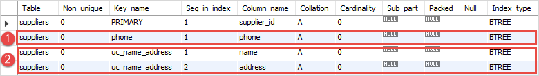
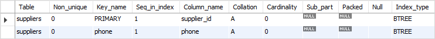

在本教程中，您将了解MySQL UNIQUE约束，以强制一列或一个组合列的值的唯一性。

## MySQL UNIQUE约束简介

有时，希望在列中强制执行唯一性值，例如供应商表中供应商的电话必须是唯一的，或者供应商名称和地址的组合不得重复，简单一点理解就是：供应商的名称可以相同，但是不能在同一个地址。

要执行此规则，需要使用`UNIQUE`约束。

`UNIQUE`约束是列约束或表约束，它定义了限制列或一组列中的值为唯一的规则。

要将`UNIQUE`约束添加到列，请使用以下语法：

```sql
CREATE TABLE table_1(
    column_name_1  data_type UNIQUE,
);
```

或者可以将`UNIQUE`约束定义为表约束，如下所示：

```sql
CREATE TABLE table_1(
   ...
   column_name_1 data_type,
   ...
   UNIQUE(column_name_1)
);
```

如果在`column_name_1`列中[插入](http://www.yiibai.com/mysql/insert-statement.html)或[更新](http://www.yiibai.com/mysql/update-data.html)导致重复值的值，MySQL将发出错误消息并拒绝更改。

如果要跨列强制执行唯一值，则必须将`UNIQUE`约束定义为表约束，并将每列用逗号分隔：

```sql
CREATE TABLE table_1(

   ...
   column_name_1 data_type,
   column_name_2 data type,
   ...
   UNIQUE(column_name_1,column_name_2)
);
```

MySQL将使用`column_name_1`和`column_name_2`列中的值的组合来评估唯一性。

如果要为`UNIQUE`约束分配一个指定的名称，可以使用`CONSTRAINT`子句，如下所示：

```sql
CREATE TABLE table_1(
   ...
   column_name_1 data_type,
   column_name_2 data type,
   ...
   CONSTRAINT constraint_name UNIQUE(column_name_1,column_name_2)
);
```

**MySQL UNIQUE约束示例**

以下语句[创建](http://www.yiibai.com/mysql/create-table.html)了一个名为`suppliers`的新表，具有两个唯一约束条件：

```sql
USE testdb;
CREATE TABLE IF NOT EXISTS suppliers (
    supplier_id INT PRIMARY KEY AUTO_INCREMENT,
    name VARCHAR(255) NOT NULL,
    phone VARCHAR(16) NOT NULL UNIQUE,
    address VARCHAR(255) NOT NULL,
    CONSTRAINT uc_name_address UNIQUE (name , address)
);
```

第一个`UNIQUE`约束应用于`phone`列。 这意味着每个供应商必须具有不同的电话号码。 换句话说，没有哪两个供应商的电话号码是相同的。
第二个`UNIQUE`约束的名称为`uc_name_address`，它强制`name`和`address`列中值的唯一性。供应商可以拥有相同的名称或地址，但名称和地址不能同时相同。

我们在`suppliers`表中插入一些行来测试`UNIQUE`约束。

以下语句将一行插入到`suppliers`表中。

```sql
INSERT INTO suppliers(name, phone, address)
VALUES('ABC Inc', '13800138000','4000 North 1st Street, San Jose, CA, USA');
```

尝试插入不同的供应商数据信息，但是使用的电话号码是一个在`suppliers`表中已经存在电话号码。

```sql
INSERT INTO suppliers(name, phone, address)
VALUES('XYZ Corporation', '13800138000','4001 North 1st Street, San Jose, CA, USA');
```

MySQL发出错误：

```sql
Error Code: 1062. Duplicate entry '13800138000' for key 'phone'
```

我们将电话号码更改为其他号码，然后再次执行插入语句。

```sql
INSERT INTO suppliers(name, phone, address)
VALUES('XYZ Corporation', '13800138111','400 North 1st Street, San Jose, CA, USA');
```

上面插入语句可以成功执行。

现在执行以下`INSERT`语句来插入一行，其中已经存在的名称和地址列中的值。

```sql
INSERT INTO suppliers(name, phone, address)
VALUES('XYZ Corporation', '13800138222','400 North 1st Street, San Jose, CA, USA');
```

MySQL发出以下错误信息 -

```sql
1062 - Duplicate entry 'XYZ Corporation-400 North 1st Street, San Jose, CA, USA' for key 'uc_name_address'
```

因为违反了`UNIQUE`约束`uc_name_address`，所以插入失败。

## 管理MySQL UNIQUE约束

当您向表中添加唯一约束时，MySQL将为数据库创建一个相应的`BTREE`索引。 以下`SHOW INDEX`语句显示在`suppliers`表上创建的所有索引。

```sql
SHOW INDEX FROM testdb.suppliers;
```

结果如下所示 -



如上图所见，有两个`BTREE`索引对应于创建的两个`UNIQUE`约束。

要删除`UNIQUE`约束，可以使用`DROP INDEX`或[ALTER TABLE](http://www.yiibai.com/mysql/alter-table.html)语句，语法如下所示：

```sql
DROP INDEX index_name ON table_name;
```

或者

```sql
ALTER TABLE table_name
DROP INDEX index_name;
```

例如，要删除`suppliers`表上的`uc_name_address`约束，需要以下语句：

```sql
DROP INDEX uc_name_address ON suppliers;
```

再次执行`SHOW INDEX`语句来验证`uc_name_unique`约束是否已经被删除。

```sql
SHOW INDEX FROM testdb.suppliers;
```

执行上面查询语句，得到以下结果



如果要将`UNIQUE`约束添加到已存在的表中，该怎么办？很简单，使用`ALTER TABLE`语句，语法如下所示：

```sql
ALTER TABLE table_name
ADD CONSTRAINT constraint_name UNIQUE (column_list);
```

例如，要将名称为`uc_name_address`的`UNIQUE`约束添加到`suppliers`表，请使用以下语句：

```sql
ALTER TABLE suppliers
ADD CONSTRAINT uc_name_address UNIQUE (name,address);
```

> 请注意，为了使语句成功执行，当然表的`name`和`address`列中的值的组合必须是唯一的。

在本教程中，您已经学习了如何使用MySQL `UNIQUE`约束来强制表中列或一组列中的值的唯一性。