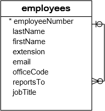

在本教程中，您将了解MySQL外键(*foreign key*)以及如何在MySQL中创建，添加和删除外键约束。

## MySQL外键简介

外键表示一个表中的一个字段被另一个表中的一个字段引用。外键对相关表中的数据造成了限制，使MySQL能够保持参照完整性。

下面来看看[示例数据库(yiibaidb)](http://www.yiibai.com/mysql/sample-database.html)中的以下数据库中两个表：`customers`和`orders``的ER图。

上图中有两张表：`customers`和`orders`。每个客户有零个或多个订单，每个订单只属于一个客户。`customers`表和`orders`表之间的关系是一对多的，它是由`customerNumber`字段指定在`orders`表中建立外键(引用`customers`表的`customerNumber`字段)。`orders`表中的`customerNumber`字段与`customers`表中的`customerNumber`主键字段相关。

`customers`表称为父表或引用表，`orders`表称为子表或引用表。

表可以有多个外键，子表中的每个外键可能引用不同的父表。

子表中的行必须包含父表中存在的值，例如，`orders`表中的每个订单记录必须在`customers`表中存在`customerNumber`。 因此，多个订单可以指同一个客户，因此这种关系称为一个(客户)到许多(订单)或一对多。

有时，子表和父表是一样的。外键返回到表的主键，例如以下`employees`表：



`reportTo`列是一个引用`employeeNumber`列的外键，`employeeNumber`列是`employees`表的主键，以反映员工之间的报告结构，即每个员工向另一个员工发送的报告和员工可以有零个或多个直接报告。有关如何使用有，请参考[自连接](http://www.yiibai.com/mysql/self-join.html)教程，以帮助您根据这种表查询来查询相关数据。

`reportTo`外键也称为递归或自引用外键。

外键执行引用完整性，可以帮助您自动维护数据的一致性和完整性。 例如，不能为不存在的客户创建订单。

此外，可以为`customerNumber`外键设置级联删除操作，以便在`customers`表中删除客户时，与客户关联的所有订单也将被删除。 这样可以节省您使用多个[DELETE语句](http://www.yiibai.com/mysql/delete-statement.html)或[DELETE JOIN语句](http://www.yiibai.com/mysql/delete-join.html)的时间和精力。

与删除相同，还可以为`customerNumber`外键定义级联更新操作，以执行交叉表更新，而不使用多个[UPDATE](http://www.yiibai.com/mysql/update-data.html)语句或[UPDATE JOIN](http://www.yiibai.com/mysql/update-join.html)语句。

在MySQL中，InnoDB[存储引擎](http://www.yiibai.com/understand-mysql-table-types-innodb-myisam.html)支持外键，因此您必须创建*InnoDB*表才能使用外键约束。

## 创建外键

**MySQL创建外键语法**

以下语法说明了如何在[CREATE TABLE](http://www.yiibai.com/mysql/create-table.html)语句中的子表中定义外键。

```sql
CONSTRAINT constraint_name
FOREIGN KEY foreign_key_name (columns)
REFERENCES parent_table(columns)
ON DELETE action
ON UPDATE action
```

下面我们来更详细的查看上面语法：

- `CONSTRAINT`子句允许您为外键约束定义约束名称。如果省略它，MySQL将自动生成一个名称。
- `FOREIGN KEY`子句指定子表中引用父表中主键列的列。您可以在`FOREIGN KEY`子句后放置一个外键名称，或者让MySQL为您创建一个名称。 请注意，MySQL会自动创建一个具有`foreign_key_name`名称的索引。
- `REFERENCES`子句指定父表及其子表中列的引用。 在`FOREIGN KEY`和`REFERENCES`中指定的子表和父表中的列数必须相同。
- `ON DELETE`子句允许定义当父表中的记录被删除时，子表的记录怎样执行操作。如果省略`ON DELETE`子句并删除父表中的记录，则MySQL将拒绝删除子表中相关联的数据。此外，MySQL还提供了一些操作，以便您可以使用其他选项，例如[ON DELETE CASCADE](http://www.yiibai.com/mysql/on-delete-cascade.html)，当删除父表中的记录时，MySQL可以删除子表中引用父表中记录的记录。 如果您不希望删除子表中的相关记录，请改用`ON DELETE SET NULL`操作。当父表中的记录被删除时，MySQL会将子表中的外键列值设置为`NULL`，条件是子表中的外键列必须接受`NULL`值。 请注意，如果使用`ON DELETE NO ACTION`或`ON DELETE RESTRICT`操作，MySQL将拒绝删除。
- `ON UPDATE`子句允许指定在父表中的行更新时，子表中的行会怎样执行操作。当父表中的行被更新时，可以省略`ON UPDATE`子句让MySQL拒绝对子表中的行的任何更新。 `ON UPDATE CASCADE`操作允许您执行交叉表更新，并且当更新父表中的行时，`ON UPDATE SET NULL`操作会将子表中行中的值重置为`NULL`值。 `ON UPDATE NO ACTION`或`UPDATE RESTRICT`操作拒绝任何更新。

**MySQL创建表外键示例**

以下示例创建一个`dbdemo`数据库和两个表：`categories`和`products`。每个类别都有一个或多个产品，每个产品只属于一个类别。 `products`表中的`cat_id`字段被定义为具有`UPDATE ON CASCADE`和`DELETE ON RESTRICT`操作的外键。

```sql
CREATE DATABASE IF NOT EXISTS dbdemo;

USE dbdemo;

CREATE TABLE categories(
   cat_id int not null auto_increment primary key,
   cat_name varchar(255) not null,
   cat_description text
) ENGINE=InnoDB;

CREATE TABLE products(
   prd_id int not null auto_increment primary key,
   prd_name varchar(355) not null,
   prd_price decimal,
   cat_id int not null,
   FOREIGN KEY fk_cat(cat_id)
   REFERENCES categories(cat_id)
   ON UPDATE CASCADE
   ON DELETE RESTRICT
)ENGINE=InnoDB;
```

## 添加外键

**MySQL添加外键语法**

要将外键添加到现有表中，请使用[ALTER TABLE](http://www.yiibai.com/mysql/alter-table.html)语句与上述外键定义语法：

```sql
ALTER table_name
ADD CONSTRAINT constraint_name
FOREIGN KEY foreign_key_name(columns)
REFERENCES parent_table(columns)
ON DELETE action
ON UPDATE action;
```

**MySQL添加外键示例**

现在，我们添加一个名为`vendors`的新表，并更改`products`表以包含供应商`ID`字段：

```sql
USE dbdemo;

CREATE TABLE vendors(
    vdr_id int not null auto_increment primary key,
    vdr_name varchar(255)
)ENGINE=InnoDB;

ALTER TABLE products 
ADD COLUMN vdr_id int not null AFTER cat_id;
```

要在`products`表中添加外键，请使用以下语句：

```sql
ALTER TABLE products
ADD FOREIGN KEY fk_vendor(vdr_id)
REFERENCES vendors(vdr_id)
ON DELETE NO ACTION
ON UPDATE CASCADE;
```

现在，`products`表有两个外键，一个是引用`categories`表，另一个是引用`vendors`表。

## 删除MySQL外键

您还可以使用`ALTER TABLE`语句将外键删除，如下语句：

```sql
ALTER TABLE table_name 
DROP FOREIGN KEY constraint_name;
```

在上面的声明中：

- 首先，指定要从中删除外键的表名称。
- 其次，将约束名称放在`DROP FOREIGN KEY`子句之后。

> 请注意，`constraint_name`是在创建或添加外键到表时指定的约束的名称。 如果省略它，MySQL会为您生成约束名称。

要获取生成的表的约束名称，请使用`SHOW CREATE TABLE`语句，如下所示：

```sql
SHOW CREATE TABLE table_name;
```

例如，要查看`products`表的外键，请使用以下语句：

```sql
SHOW CREATE TABLE products;
```

以下是语句的输出：

```sql
CREATE TABLE products (
  prd_id int(11) NOT NULL AUTO_INCREMENT,
  prd_name varchar(355) NOT NULL,
  prd_price decimal(10,0) DEFAULT NULL,
  cat_id int(11) NOT NULL,
  vdr_id int(11) NOT NULL,
  PRIMARY KEY (prd_id),
  KEY fk_cat (cat_id),
  KEY fk_vendor(vdr_id),

  CONSTRAINT products_ibfk_2 
  FOREIGN KEY (vdr_id) 
  REFERENCES vendors (vdr_id) 
  ON DELETE NO ACTION 
  ON UPDATE CASCADE,

  CONSTRAINT products_ibfk_1 
  FOREIGN KEY (cat_id) 
  REFERENCES categories (cat_id) 
  ON UPDATE CASCADE
) ENGINE=InnoDB;
```

`products`表有两个外键约束：`products_ibfk_1`和`products_ibfk_2`。

可以使用以下语句删除`products`表的外键：

```sql
ALTER TABLE products 
DROP FOREIGN KEY products_ibfk_1;

ALTER TABLE products 
DROP FOREIGN KEY products_ibfk_2;
```

## MySQL禁用外键检查

有时，因为某种原因需要禁用外键检查(例如[将CSV文件中的数据导入表](http://www.yiibai.com/import-csv-file-mysql-table.html)中)非常有用。 如果不禁用外键检查，则必须以正确的顺序加载数据，即必须首先将数据加载到父表中，然后再将数据加载导入到子表中，这可能是乏味的。 但是，如果禁用外键检查，则可以按任何顺序加载导入数据。

除非禁用外键检查，否则不能删除由外键约束引用的表。删除表时，还会删除为表定义的任何约束。

要禁用外键检查，请使用以下语句：

```sql
SET foreign_key_checks = 0;
```

当然，可以使用以下语句启用它：

```sql
SET foreign_key_checks = 1;
```

在本教程中，我们已经介绍了很多有关MySQL外键的内容。还向您介绍了一些非常方便的语句，允许您在MySQL中有效地管理外键。