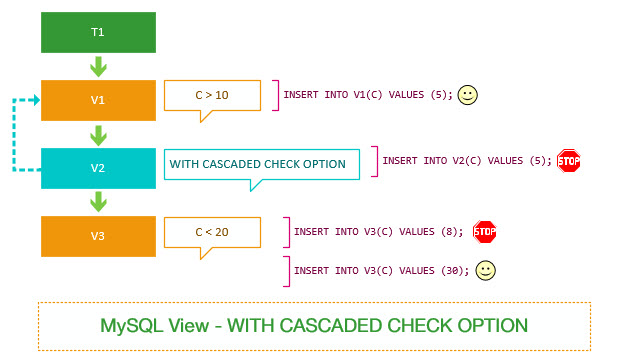

本教程通过示例和清楚的说明帮助，了解`WITH CHECK OPTION`子句中`LOCAL`和`CASCADED`之间的差异。

在进行本教程之前，应该熟悉`WITH CHECK OPTION`子句。如果不是这样，可以[参阅WITH CHECK OPTION子句教程](http://www.yiibai.com/mysql/view-with-check-option.html)来遵循确保视图的一致性。

## LOCAL＆CASCADED检查范围介绍

当使用`WITH CHECK OPTION`子句[创建视图](http://www.yiibai.com/mysql/create-sql-views-mysql.html)时，MySQL会通过视图检查正在更改的每个行，例如[插入](http://www.yiibai.com/mysql/mysql/insert-statement.html)，[更新](http://www.yiibai.com/mysql/update-data.html)，[删除](http://www.yiibai.com/mysql/delete-statement.html)，以使其符合视图的定义。因为MySQL允许基于另一个视图创建视图，它还会检查依赖视图中的规则以保持一致性。

为了确定检查的范围，MySQL提供了两个选项：`LOCAL`和`CASCADED`。如果您没有在`WITH CHECK OPTION`子句中显式指定关键字，则MySQL默认使用`CASCADED`。

## MySQL与CASCADC检查选项

要了解使用`CASCADED CHECK OPTION`的效果，请参阅下面的例子。

首先，[创建](http://www.yiibai.com/mysql/create-table.html)一个名为`t1`的表，其中只有一个名称为：`c`的列，它的数据类型为`int`。

```sql
USE testdb;
CREATE TABLE t1 (
    c INT
);
```

接下来，基于`t1`表创建一个名为`v1`的视图，以选择值大于`10`的行记录。

```sql
CREATE OR REPLACE VIEW v1 
AS
    SELECT 
        c
    FROM
        t1
    WHERE
        c > 10;
```

因为没有指定`WITH CHECK OPTION`，所以以下语句即使不符合`v1`视图的定义也可以工作。

```sql
INSERT INTO v1(c) VALUES (5);
```

然后，基于`v1`视图创建`v2`视图。在`v2`视图中添加一个`WITH CASCADED CHECK OPTION`子句。

```sql
CREATE OR REPLACE VIEW v2 
AS
    SELECT 
        c
    FROM
        v1 
WITH CASCADED CHECK OPTION;
```

现在，通过`v2`视图在`t1`表中[插入](http://www.yiibai.com/mysql/insert-statement.html)一个值为`5`的行。

```sql
INSERT INTO v2(c) VALUES (5);
```

MySQL发出以下错误消息：

```sql
Error Code: 1369. CHECK OPTION failed 'testdb.v2'
```

它失败了，因为它创建一个不符合`v2`视图定义的新行。

之后，我们再创建一个基于`v2`的名为`v3`的新视图。

```sql
CREATE OR REPLACE VIEW v3 
AS
    SELECT 
        c
    FROM
        v2
    WHERE
        c < 20;
```

我们通过`v3`视图插入一个新行到`t1`表中，值为`8`。

```sql
INSERT INTO v3(c) VALUES (8);
```

MySQL发出以下错误信息：

```sql
Error Code: 1369. CHECK OPTION failed 'testdb.v3'
```

上面插入语句看起来符合`v3`视图的定义，[insert语句](http://www.yiibai.com/mysql/insert-statement.html)仍然执行失败。

**这是为什么呢？**

因为`v3`视图取决于`v2`视图，`v2`视图具有`WITH CASCADED CHECK OPTION`。

但是，以下插入语句能正常工作。

```sql
INSERT INTO v3(c) VALUES (30);
```

因为`v3`视图没有使用`WITH CHECK OPTION`定义，并且该语句符合`v2`视图的定义。

所以，总而言之：

当视图使用`WITH CASCADED CHECK OPTION`时，MySQL会循环检查视图的规则以及底层视图的规则。



## MySQL WITH LOCAL CHECK OPTION

下面将演示使用 `WITH LOCAL CHECK OPTION` 选项，使用上面相同的示例来查看差异。

首先，将`v2`视图更改为使用`WITH LOCAL CHECK OPTIONS`替代。

```sql
ALTER VIEW v2 AS
    SELECT 
        c
    FROM
        v1 
WITH LOCAL CHECK OPTION;
```

*其次*，插入与上述示例相同的行。

```sql
INSERT INTO v2(c) VALUES (5);
```

它是可以成功执行的。

因为`v2`视图没有任何规则。 `v2`视图取决于`v1`视图。 但是，`v1`视图没有指定检查选项，因此MySQL跳过检查`v1`视图中的规则。

> 请注意，在使用`WITH CASCADED CHECK OPTION`创建的`v2`视图中，此语句失败。

*第三*，通过`v3`视图将相同的行插入`t1`表。

```sql
INSERT INTO v3(c) VALUES (8);
```

在这种情况下可以执行成功，因为MySQL视图中的`WITH LOCAL CHECK OPTIONS`选项没有检查`v1`视图的规则。
另外，请注意，在使用`WITH CASCADED CHECK OPTION`创建的`v2`视图示例中，此语句执行失败。


因此，如果视图使用`WITH LOCAL CHECK OPTION`，MySQL会检查`WITH LOCAL CHECK OPTION`和`WITH CASCADED CHECK OPTION`选项的视图规则。

与使用`WITH CASCADED CHECK OPTION`的视图不同，MySQL检查所有依赖视图的规则。

> 请注意，在*MySQL 5.7.6*之前，如果您使用带有`WITH LOCAL CHECK OPTION`的视图，MySQL只会检查当前视图的规则，并且不会检查底层视图的规则。