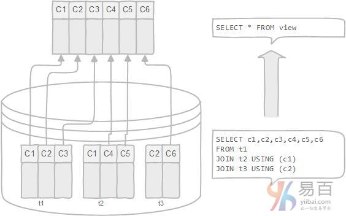

在本教程中，您将了解一个叫作*数据库视图*的新数据库对象。 我们将讨论使用数据库视图的优缺点。

数据库视图是虚拟表或逻辑表，它被定义为具有[连接](http://www.yiibai.com/mysql/inner-join.html)的SQL [SELECT](http://www.yiibai.com/mysql/select-statement-query-data.html)查询语句。 因为数据库视图与数据库表类似，它由行和列组成，因此可以根据数据库表查询数据。 大多数数据库管理系统(包括MySQL)允许您通过具有一些先决条件的数据库视图来[更新](http://www.yiibai.com/mysql/update-data.html)基础表中的数据。

数据库视图是动态的，因为它与物理模式无关。数据库系统将数据库视图存储为具有连接的[SQL SELECT](http://www.yiibai.com/mysql/select-statement-query-data.html)语句。当表的数据发生变化时，视图也反映了这些数据的变化。

## 数据库视图的优点

以下是使用数据库视图的优点 -

- 数据库视图允许简化复杂查询：数据库视图由与许多基础表相关联的SQL语句定义。 您可以使用数据库视图来隐藏最终用户和外部应用程序的基础表的复杂性。 通过数据库视图，您只需使用简单的SQL语句，而不是使用具有多个连接的复杂的SQL语句。
- 数据库视图有助于限制对特定用户的数据访问。 您可能不希望所有用户都可以查询敏感数据的子集。可以使用数据库视图将非敏感数据仅显示给特定用户组。
- 数据库视图提供额外的安全层。 安全是任何关系数据库管理系统的重要组成部分。 数据库视图为数据库管理系统提供了额外的安全性。 数据库视图允许您创建只读视图，以将只读数据公开给特定用户。 用户只能以只读视图检索数据，但无法更新。
- 数据库视图启用计算列。 数据库表不应该具有计算列，但数据库视图可以这样。 假设在`orderDetails`表中有`quantityOrder`(产品的数量)和`priceEach`(产品的价格)列。 但是，`orderDetails`表没有一个列用来存储订单的每个订单项的总销售额。如果有，数据库模式不是一个好的设计。 在这种情况下，您可以创建一个名为`total`的计算列，该列是`quantityOrder`和`priceEach`的乘积，以表示计算结果。当您从数据库视图中查询数据时，计算列的数据将随机计算产生。
- 数据库视图实现向后兼容。 假设你有一个中央数据库，许多应用程序正在使用它。 有一天，您决定重新设计数据库以适应新的业务需求。删除一些表并创建新的表，并且不希望更改影响其他应用程序。在这种情况下，可以创建与将要删除的旧表相同的模式的数据库视图。

## 数据库视图的缺点

除了上面的优点，使用数据库视图有几个缺点：

- *性能*：从数据库视图查询数据可能会很慢，特别是如果视图是基于其他视图创建的。
- *表依赖关系*：将根据数据库的基础表创建一个视图。每当更改与其相关联的表的结构时，都必须更改视图。

在本教程中，您已经了解了数据库视图是什么。我们还介绍了使用数据库视图的优缺点，以便您可以在数据库设计中有效地应用数据库视图。