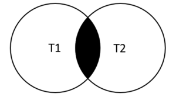
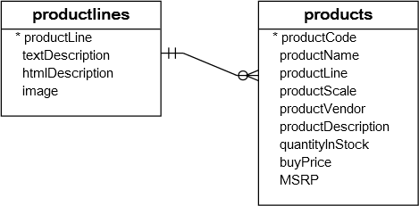
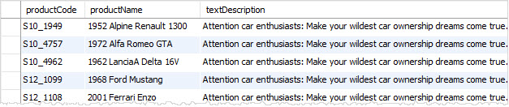
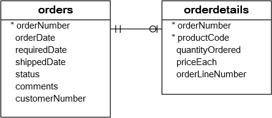
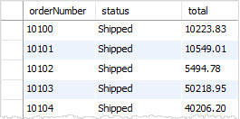

在本教程中，您将学习如何使用MySQL `INNER JOIN`子句根据连接条件从多个表中查询选择数据。

## MySQL INNER JOIN子句介绍

MySQL `INNER JOIN`子句将一个表中的行与其他表中的行进行匹配，并允许从两个表中查询包含列的行记录。

`INNER JOIN`子句是`SELECT`语句的可选部分，它出现在[FROM子句](http://www.yiibai.com/mysql/select-statement-query-data.html)之后。

在使用`INNER JOIN`子句之前，必须指定以下条件：

- 首先，在FROM子句中指定主表。
- 其次，表中要连接的主表应该出现在`INNER JOIN`子句中。理论上说，可以连接多个其他表。 但是，为了获得更好的性能，应该限制要连接的表的数量(最好不要超过三个表)。
- 第三，连接条件或连接谓词。连接条件出现在`INNER JOIN`子句的`ON`关键字之后。连接条件是将主表中的行与其他表中的行进行匹配的规则。

`INNER JOIN`子句的语法如下：

```sql
SELECT column_list
FROM t1
INNER JOIN t2 ON join_condition1
INNER JOIN t3 ON join_condition2
...
WHERE where_conditions;
```

假设使用`INNER JOIN`子句连接两个表：`t1`和`t2`，我们来简化上面的语法。

```sql
SELECT column_list
FROM t1
INNER JOIN t2 ON join_condition;
```

对于`t1`表中的每一行，`INNER JOIN`子句将它与`t2`表的每一行进行比较，以检查它们是否都满足连接条件。当满足连接条件时，`INNER JOIN`将返回由`t1`和`t2`表中的列组成的新行。

请注意，`t1`和`t2`表中的行必须根据连接条件进行匹配。如果找不到匹配项，查询将返回一个空结果集。当连接超过`2`个表时，也应用此逻辑。

以下维恩图说明了`INNER JOIN`子句的工作原理。结果集中的行必须出现在两个表中：`t1`和`t2`，如两个圆的交叉部分所示 -



## 在MySQL INNER JOIN中避免列错误

如果连接具有相同列名称的多个表，则必须使用表限定符引用`SELECT`和`ON`子句的列，以避免列错误。

例如，如果`t1`和`t2`表都具有名为`c`的一个相同列名，则必须在`SELECT`和`ON`子句中使用表限定符，如使用`t1.c`或`t2.c`指定引用是那个表中的`c`列。

为了节省书写表限定符的时间，可以在查询中使用表别名。 例如，可以长名称`verylonglonglong_tablename`表使用表别名，并使用`t.column`引用其列，而不是使用`verylonglonglong_tablename.column`，但是如果喜欢书写或使用这么长的表名称，那么也应该允许你的开发伙伴骂你几句类似：*傻逼*~等这样的话！

## MySQL INNER JOIN示例

下面来看看[示例数据库(yiibaidb)](http://www.yiibai.com/mysql/sample-database.html)中的产品(`products`)和产品线(`productlines`)表。它们的 *ER* 图如下所示 -



在上面图中，`products`表中的`productLine`列参考引用`productlines`表的`productline`列。 `products`表中的`productLine`列称为[外键](http://www.yiibai.com/mysql/foreign-key.html)列。

通常，连接具有外键关系的表，如产品线(`productlines`)和产品(`products`)表。现在，如果想获取以下数据 -

- 获取`products`表中的`productCode`和`productName`列的值。
- 获取`productlines`表产品线的描述 - `textDescription`列的值。

为此，需要通过使用`INNER JOIN`子句根据`productline`列匹配行来从两个表中查询选择数据，如下所示：

```
SELECT 
    productCode, 
    productName, 
    textDescription
FROM
    products t1
        INNER JOIN
    productlines t2 ON t1.productline = t2.productline;
```

执行上面查询，得到下面的结果(部分)-



由于两个表的连接列是使用相同一个列：`productline`，因此可以使用以下语法：

```sql
SELECT 
    productCode, 
    productName, 
    textDescription
FROM
    products
        INNER JOIN
    productlines USING (productline);
```

上面语句返回相同的结果集，但是使用此语法，不必使用表的别名。

**MySQL INNER JOIN GROUP BY子句**

请参阅以下订单和订单详细表，`orders`表和`orderdetails`表的结构如下所示 -



可以使用具有[GROUP BY](http://www.yiibai.com/mysql/group-by.html)子句的`INNER JOIN`子句从`orders`和`orderdetails`表中获取订单号，订单状态和总销售额，如下所示：

```sql
SELECT 
    T1.orderNumber,
    status,
    SUM(quantityOrdered * priceEach) total
FROM
    orders AS T1
        INNER JOIN
    orderdetails AS T2 ON T1.orderNumber = T2.orderNumber
GROUP BY orderNumber;
```

执行上面查询，结果如下所示(部分) -



类似地，以下语句查询与上述得到结果相同：

```sql
SELECT 
    orderNumber,
    status,
    SUM(quantityOrdered * priceEach) total
FROM
    orders
        INNER JOIN
    orderdetails USING (orderNumber)
GROUP BY orderNumber;
```

**MySQL INNER JOIN使用等于以外的运算符**

到目前为止，您已经看到连接谓词使用相等的运算符(`=`)来匹配行。但是也可以使用大于(`>`)，小于(`<`)和不等于(`<>`)运算符的其他运算符来形成连接谓词。

以下查询使用少于(`<`)连接来查找低于代码为`S10_1678`的产品的销售价格的制造商建议零售价(`MSRP`)的所有产品。

```sql
SELECT 
    orderNumber, 
    productName, 
    msrp, 
    priceEach
FROM
    products p
        INNER JOIN
    orderdetails o ON p.productcode = o.productcode
        AND p.msrp > o.priceEach
WHERE
    p.productcode = 'S10_1678';
```

执行上面查询语句，得到以下输出结果 -

```sql
mysql> SELECT 
    orderNumber, 
    productName, 
    msrp, 
    priceEach
FROM
    products p
        INNER JOIN
    orderdetails o ON p.productcode = o.productcode
        AND p.msrp > o.priceEach
WHERE
    p.productcode = 'S10_1678';
+-------------+---------------------------------------+------+-----------+
| orderNumber | productName                           | msrp | priceEach |
+-------------+---------------------------------------+------+-----------+
|       10107 | 1969 Harley Davidson Ultimate Chopper | 95.7 | 81.35     |
|       10121 | 1969 Harley Davidson Ultimate Chopper | 95.7 | 86.13     |
|       10134 | 1969 Harley Davidson Ultimate Chopper | 95.7 | 90.92     |
|       10145 | 1969 Harley Davidson Ultimate Chopper | 95.7 | 76.56     |
|       10159 | 1969 Harley Davidson Ultimate Chopper | 95.7 | 81.35     |
|       10168 | 1969 Harley Davidson Ultimate Chopper | 95.7 | 94.74     |
|       10399 | 1969 Harley Davidson Ultimate Chopper | 95.7 | 77.52     |
|       10403 | 1969 Harley Davidson Ultimate Chopper | 95.7 | 85.17     |
... ...
|       10417 | 1969 Harley Davidson Ultimate Chopper | 95.7 | 79.43     |
+-------------+---------------------------------------+------+-----------+
26 rows in set
```

在本教程中，您已经学会了如何使用MySQL `INNER JOIN`来查询来自多个表中的数据。