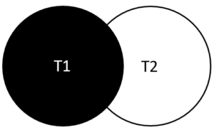

在本教程中，您将了解MySQL `LEFT JOIN`子句以及如何将其应用于从两个或多个数据库表查询数据。

## 1. MySQL LEFT JOIN简介

MySQL `LEFT JOIN`子句允许您从两个或多个数据库表查询数据。`LEFT JOIN`子句是[SELECT](http://www.yiibai.com/mysql/select-statement-query-data.html)语句的可选部分，出现在`FROM`子句之后。

我们假设要从两个表`t1`和`t2`查询数据。以下语句说明了连接两个表的`LEFT JOIN`子句的语法：

```sql
SELECT 
    t1.c1, t1.c2, t2.c1, t2.c2
FROM
    t1
        LEFT JOIN
    t2 ON t1.c1 = t2.c1;
```

当使用`LEFT JOIN`子句将`t1`表加入`t2`表时，如果来自左表`t1`的行与基于连接条件(`t1.c1 = t2.c1`)的右表`t2`匹配，则该行将被包含在结果集中。

如果左表中的行与右表中的行不匹配，则还将选择左表中的行并与右表中的“*假*”行组合。“*假*”行对于`SELECT`子句中的所有相应列都包含`NULL`值。

换句话说，`LEFT JOIN`子句允许您从匹配的左右表中查询选择行记录，连接左表(`t1`)中的所有行，即使在右表(`t2`)中找不到匹配的行也显示出来，但使用`NULL`值代替。

下图可帮助您可视化`LEFT JOIN`子句的工作原理。 两个圆圈之间的交点是两个表中匹配的行，左圆的剩余部分(白色部分)是`t1`表中不存在`t2`表中任何匹配行的行。 因此，左表中的所有行都包含在结果集中。



请注意，如果这些子句在查询中可用，返回的行也必须与[WHERE](http://www.yiibai.com/mysql/where.html)和[HAVING](http://www.yiibai.com/mysql/having.html)子句中的条件相匹配。

## 2. MySQL LEFT JOIN示例

**2.1 使用MySQL LEFT JOIN子句来连接两个表**

我们来看看在[示例数据库(yiibaidb)](http://www.yiibai.com/mysql/sample-database.html)中的两个表：订单表和客户表，两个表的 *ER* 图如下所示 -


在上面的数据库图中：

- 订单(`orders`)表中的每个订单必须属于客户(`customers`)表中的客户。
- 客户(`customers`)表中的每个客户在订单(`orders`)表中可以有零个或多个订单。

要查询每个客户的所有订单，可以使用`LEFT JOIN`子句，如下所示：

```sql
SELECT
 c.customerNumber,
 c.customerName,
 orderNumber,
 o.status
FROM
 customers c
LEFT JOIN orders o ON c.customerNumber = o.customerNumber;
```

执行上面查询语句，得到以下结果(部分) -

```sql
mysql> SELECT
 c.customerNumber,
 c.customerName,
 orderNumber,
 o.status
FROM
 customers c
LEFT JOIN orders o ON c.customerNumber = o.customerNumber;
+----------------+------------------------------------+-------------+------------+
| customerNumber | customerName                       | orderNumber | status     |
+----------------+------------------------------------+-------------+------------+
|            103 | Atelier graphique                  |       10123 | Shipped    |
|            103 | Atelier graphique                  |       10298 | Shipped   |
... 省略部分 ...
|            477 | Mit Vergngen & Co.                 | NULL        | NULL       |
|            480 | Kremlin Collectables, Co.          | NULL        | NULL       |
|            481 | Raanan Stores, Inc                 | NULL        | NULL       |
|            484 | Iberia Gift Imports, Corp.         |       10184 | Shipped    |
|            484 | Iberia Gift Imports, Corp.         |       10303 | Shipped    |
|            486 | Motor Mint Distributors Inc.       |       10109 | Shipped    |
|            486 | Motor Mint Distributors Inc.       |       10236 | Shipped  |
+----------------+------------------------------------+-------------+------------+
350 rows in set
```

左表是`customers`表，因此，所有客户都包含在结果集中。 但是，结果集中有一些行具有客户数据，但没有订单数据。如：`customerNumber`列值为：`477`，`480`等。这些行中的订单数据为`NULL`。也就是说这些客户在`orders`表中没有任何订单(未购买过任何产品)。

因为我们使用相同的列名(`orderNumber`)来连接两个表，所以可以使用以下语法使查询更短：

```sql
SELECT
 c.customerNumber,
 customerName,
 orderNumber,
 status
FROM
 customers c
LEFT JOIN orders USING (customerNumber);
```

在上面查询语句中，下面的子句 -

```sql
USING (customerNumber)
```

相当于 -

```sql
ON c.customerNumber = o.customerNumber
```

如果使用[INNER JOIN](http://www.yiibai.com/mysql/inner-join.html)子句替换`LEFT JOIN`子句，则只能获得至少有下过一个订单的客户。

**2.2 使用MySQL LEFT JOIN子句来查找不匹配的行**

当您想要找到右表中与不匹配的左表中的行时，`LEFT JOIN`子句非常有用。要查询两个表之间的不匹配行，可以向SELECT语句添加一个[WHERE子句](http://www.yiibai.com/mysql/where.html)，以仅查询右表中的列值包含`NULL`值的行。

例如，要查找没有下过订单的所有客户，请使用以下查询：

```sql
SELECT 
    c.customerNumber, 
    c.customerName, 
    orderNumber, 
    o.status
FROM
    customers c
        LEFT JOIN
    orders o ON c.customerNumber = o.customerNumber
WHERE
    orderNumber IS NULL;
```

执行上面查询语句，得到以下结果 -

```sql
mysql> SELECT 
    c.customerNumber, 
    c.customerName, 
    orderNumber, 
    o.status
FROM
    customers c
        LEFT JOIN
    orders o ON c.customerNumber = o.customerNumber
WHERE
    orderNumber IS NULL;
+----------------+--------------------------------+-------------+--------+
| customerNumber | customerName                   | orderNumber | status |
+----------------+--------------------------------+-------------+--------+
|            125 | Havel & Zbyszek Co             | NULL        | NULL   |
|            168 | American Souvenirs Inc         | NULL        | NULL   |
|            169 | Porto Imports Co.              | NULL        | NULL   |
|            206 | Asian Shopping Network, Co     | NULL        | NULL   |
|            223 | Natrlich Autos                 | NULL        | NULL   |
|            237 | ANG Resellers                  | NULL        | NULL   |
|            247 | Messner Shopping Network       | NULL        | NULL   |
|            273 | Franken Gifts, Co              | NULL        | NULL   |
|            293 | BG&E Collectables              | NULL        | NULL   |
|            303 | Schuyler Imports               | NULL        | NULL   |
|            307 | Der Hund Imports               | NULL        | NULL   |
|            335 | Cramer Spezialitten, Ltd       | NULL        | NULL   |
|            348 | Asian Treasures, Inc.          | NULL        | NULL   |
|            356 | SAR Distributors, Co           | NULL        | NULL   |
|            361 | Kommission Auto                | NULL        | NULL   |
|            369 | Lisboa Souveniers, Inc         | NULL        | NULL   |
|            376 | Precious Collectables          | NULL        | NULL   |
|            409 | Stuttgart Collectable Exchange | NULL        | NULL   |
|            443 | Feuer Online Stores, Inc       | NULL        | NULL   |
|            459 | Warburg Exchange               | NULL        | NULL   |
|            465 | Anton Designs, Ltd.            | NULL        | NULL   |
|            477 | Mit Vergngen & Co.             | NULL        | NULL   |
|            480 | Kremlin Collectables, Co.      | NULL        | NULL   |
|            481 | Raanan Stores, Inc             | NULL        | NULL   |
+----------------+--------------------------------+-------------+--------+
24 rows in set
```

## 3. WHERE子句与ON子句中的条件

请参见以下示例。

```sql
SELECT 
    o.orderNumber, 
    customerNumber, 
    productCode
FROM
    orders o
        LEFT JOIN
    orderDetails USING (orderNumber)
WHERE
    orderNumber = 10123;
```

在本示例中，我们使用`LEFT JOIN`子句来查询`orders`表和`orderDetails`表中的数据。 该查询返回订单号为`10123`的订单及其购买产品明细信息(如果有的话)。

```sql
mysql> SELECT 
    o.orderNumber, 
    customerNumber, 
    productCode
FROM
    orders o
        LEFT JOIN
    orderDetails USING (orderNumber)
WHERE
    orderNumber = 10123;
+-------------+----------------+-------------+
| orderNumber | customerNumber | productCode |
+-------------+----------------+-------------+
|       10123 |            103 | S18_1589    |
|       10123 |            103 | S18_2870    |
|       10123 |            103 | S18_3685    |
|       10123 |            103 | S24_1628    |
+-------------+----------------+-------------+
4 rows in set
```

但是，如果将条件从`WHERE`子句移动到`ON`子句：

```sql
SELECT 
    o.orderNumber, 
    customerNumber, 
    productCode
FROM
    orders o
        LEFT JOIN
    orderDetails d ON o.orderNumber = d.orderNumber
        AND o.orderNumber = 10123;
```

想想上面代码将会输出什么结果 -

```sql
mysql> SELECT 
    o.orderNumber, 
    customerNumber, 
    productCode
FROM
    orders o
        LEFT JOIN
    orderDetails d ON o.orderNumber = d.orderNumber
        AND o.orderNumber = 10123;
+-------------+----------------+-------------+
| orderNumber | customerNumber | productCode |
+-------------+----------------+-------------+
|       10123 |            103 | S18_1589    |
|       10123 |            103 | S18_2870    |
|       10123 |            103 | S18_3685    |
|       10123 |            103 | S24_1628    |
|       10298 |            103 | NULL        |
|       10345 |            103 | NULL        |
|       10124 |            112 | NULL        |
.... .... 
|       10179 |            496 | NULL        |
|       10360 |            496 | NULL        |
|       10399 |            496 | NULL        |
+-------------+----------------+-------------+
329 rows in set
```

请注意，对于[INNER JOIN](http://www.yiibai.com/mysql/inner-join.html)子句，`ON`子句中的条件等同于`WHERE`子句中的条件。

在本教程中，我们解释了MySQL `LEFT JOIN`子句，并向您展示了如何将使用它来从多个数据库表中查询数据。