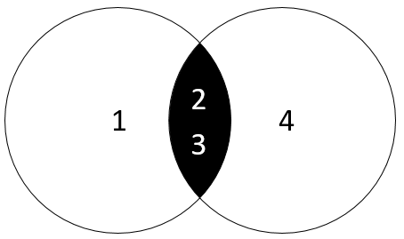

在本教程中，我们将向您介绍SQL `INTERSECT`运算符，并展示如何模拟MySQL `INTERSECT`运算符(交集)。

## 1. SQL INTERSECT操作符简介

`INTERSECT`运算符是一个集合运算符，它只返回两个查询或更多查询的交集。

以下说明`INTERSECT`运算符的语法。

```sql
(SELECT column_list 
FROM table_1)
INTERSECT
(SELECT column_list
FROM table_2);
```

`INTERSECT`运算符比较两个查询的结果，并返回由左和右查询输出的不同行记录。

要将`INTERSECT`运算符用于两个查询，应用以下规则：

- 列的顺序和数量必须相同。
- 相应列的数据类型必须兼容或可转换。

下图说明了`INTERSECT`运算符。



左侧查询产生一个结果集(`1`,`2`,`3`)，右侧查询返回一个结果集(`2`,`3`,`4`)。

`INTERSECT`操作符返回包含(`2`,`3`)，也就是两个结果集的相叉的行记录。与UNION运[算符](http://www.yiibai.com/sql-union-mysql.html)不同，`INTERSECT`运算符返回两个集合之间的交点。

请注意，SQL标准有三个集合运算符，包括[UNION](http://www.yiibai.com/sql-union-mysql.html)，`INTERSECT`和[MINUS](http://www.yiibai.com/mysql/minus.html)。

## 2. MySQL INTERSECT模拟

不幸的是，MySQL不支持`INTERSECT`操作符。 但是我们可以模拟`INTERSECT`操作符。

我们为演示创建一些示例数据。

以下语句[创建](http://www.yiibai.com/mysql/create-table.html)表`t1`和`t2`，然后将数据[插入](http://www.yiibai.com/mysql/insert-statement.html)到两个表中。

```sql
USE testdb;

DROP TABLE IF exists t1;
DROP TABLE IF exists t2;

CREATE TABLE t1 (
    id INT PRIMARY KEY
);

CREATE TABLE t2 LIKE t1;

INSERT INTO t1(id) VALUES(1),(2),(3);

INSERT INTO t2(id) VALUES(2),(3),(4);
```

以下从`t1`表查询返回行记录如下 -

```sql
mysql> SELECT id FROM t1;
+----+
| id |
+----+
|  1 |
|  2 |
|  3 |
+----+
3 rows in set
```

以下从`t2`表查询返回行记录如下 -

```sql
mysql> SELECT id FROM t2;
+----+
| id |
+----+
|  2 |
|  3 |
|  4 |
+----+
3 rows in set
```

**使用DISTINCT运算符和INNER JOIN子句模拟MySQL INTERSECT运算符**

以下语句使用[DISTINCT](http://www.yiibai.com/mysql/distinct.html)运算符和[INNER JOIN](http://www.yiibai.com/mysql/inner-join.html)子句来返回两个表中的相交集合：

```sql
SELECT DISTINCT 
   id 
FROM t1
   INNER JOIN t2 USING(id);
```

执行上面查询语句，得到以下结果 -

```sql
+----+
| id |
+----+
|  2 |
|  3 |
+----+
2 rows in set
```

上面语句是怎么工作的？

- `INNER JOIN`子句从左表和右表返回所有符合条件的行记录。
- `DISTINCT`运算符删除重复行。

**使用IN运算符和子查询模拟MySQL INTERSECT运算符**

以下语句使用[IN运算符](http://www.yiibai.com/sql-in.html)和[子查询](http://www.yiibai.com/mysql/subquery.html)返回两个结果集的交集。

```sql
SELECT DISTINCT
    id
FROM
    t1
WHERE
    id IN (SELECT 
            id
        FROM
            t2);
```

执行以上查询语句，得到以下结果 -

```sql
+----+
| id |
+----+
|  2 |
|  3 |
+----+
2 rows in set
```

上面查询语句是如何工作的？

- 子查询返回第一个结果集。
- 外部查询使用`IN`运算符仅选择第一个结果集中的值。`DISTINCT`运算符确保只选择不同的值。

在本教程中，您已经学习了几种方法来模拟MySQL中的`INTERSECT`(交集)运算符。